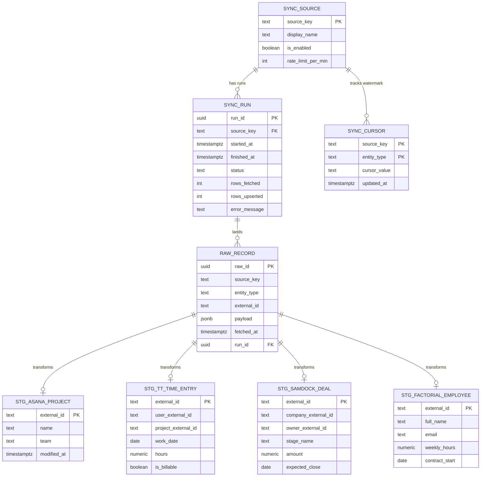
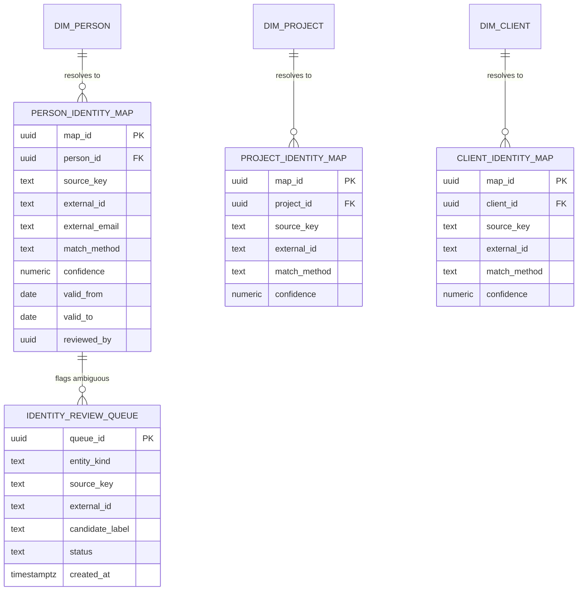
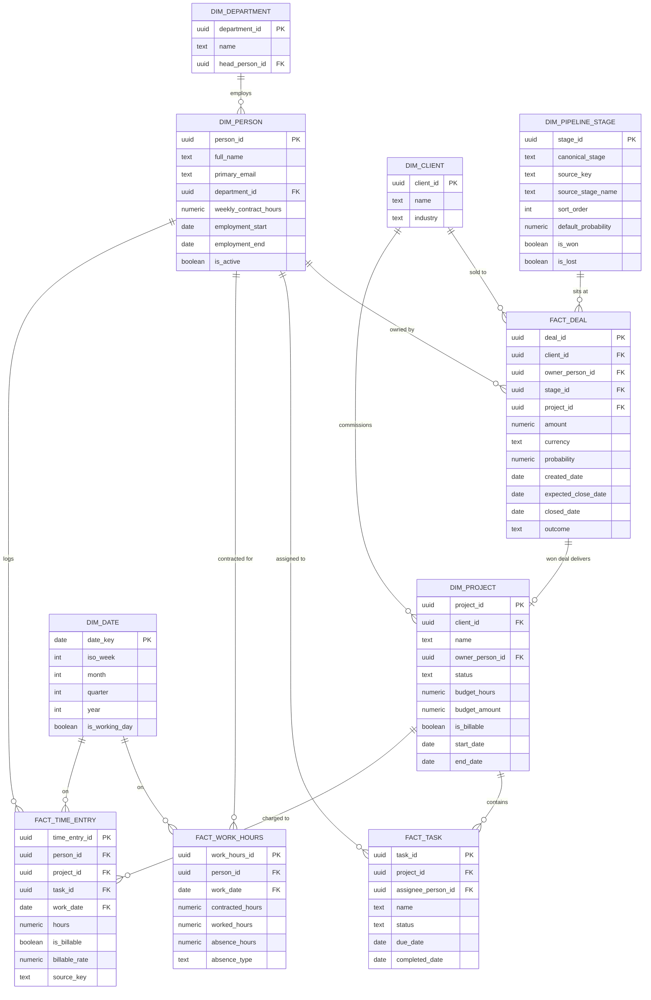
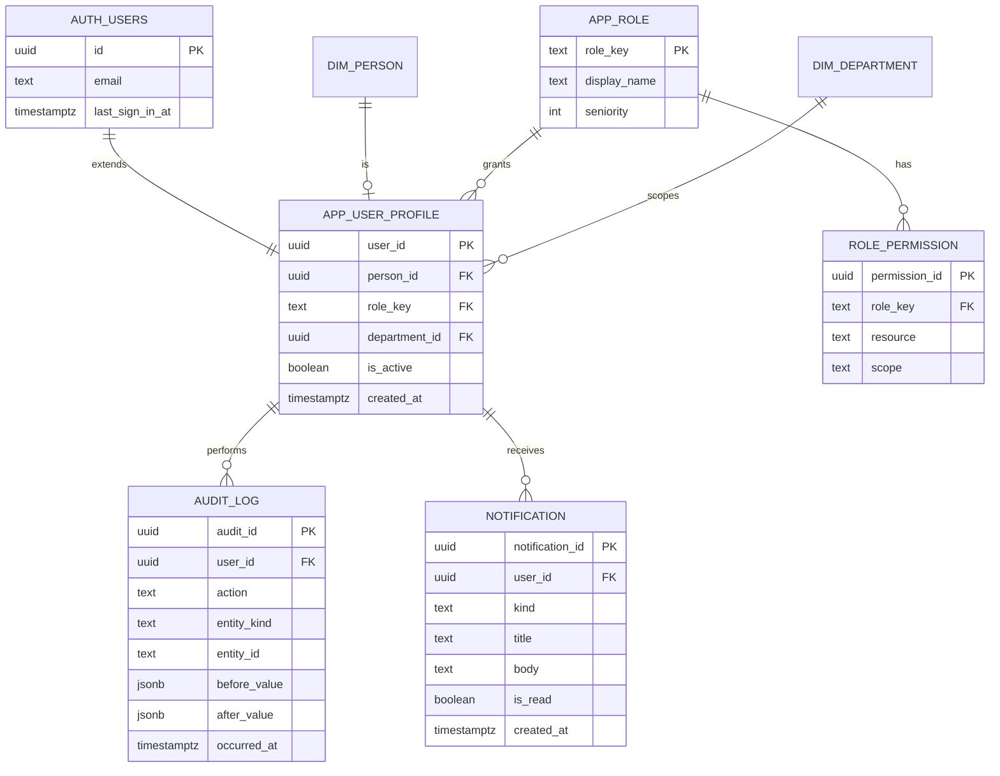
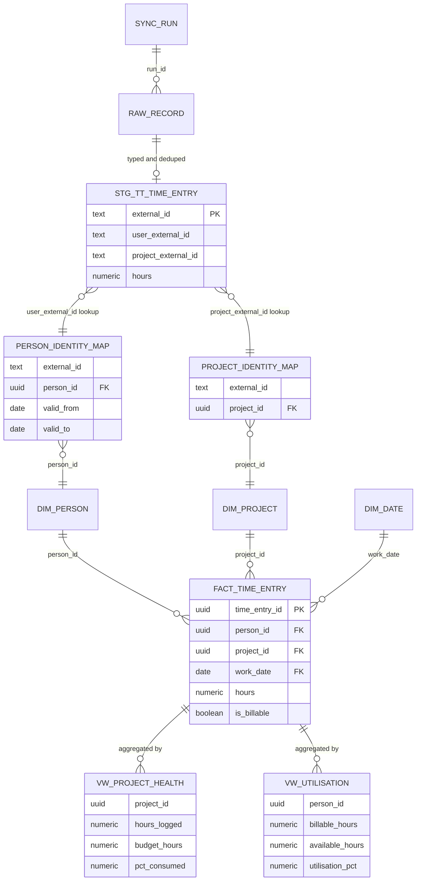

# HSE Hub — Portal Architecture & Design

Source of truth: [Miro board — "HSE Hub — Portal Architecture & Design"](https://miro.com/app/board/uXjVHy5T4YI=/).
This document mirrors that board so the design is versioned and reviewable alongside the code. If the
two ever disagree, treat the Miro board as the live discussion space and this file as the last-synced
snapshot — update this file after material board changes.

Architecture, identity resolution and dashboard design for the HSE Hub internal BI portal — aggregating
**Asana**, **TrackingTime**, **Samdock** (CRM) and **FactorialHR** into one warehouse and one metrics layer.

## 1. Data Flow Architecture

Four external systems land in our own warehouse, get conformed into one model, and feed role-based
dashboards. The warehouse becomes the continuous record — it outlives any single tool we swap out.

```
SOURCE SYSTEMS          SYNC LAYER                    WAREHOUSE (SUPABASE POSTGRES)         METRICS + DASHBOARDS
─────────────           ──────────                    ─────────────────────────────         ────────────────────
ASANA                   SYNC FRAMEWORK — one           RAW — verbatim JSON,                  METRICS LAYER — every
 projects, tasks,        connector interface:           append-only, fetched_at               KPI defined once, in SQL
 users, teams            fetch, retry, rate-limit,
                         incremental cursor,           STAGING — typed, deduped,             CEO / EXEC overview
TRACKINGTIME             idempotent upsert,             per source
 time entries,           run logging                                                         DEPT HEAD
 billable flag,                                        ANALYTICS — conformed:
 budgets                RLS — role + site scoping       person, project, client,             PROJECT MANAGER
                         enforced in the database,       deal, time_entry, work_hours
SAMDOCK (CRM)            not the UI                                                          EMPLOYEE — own data
 deals, stages,
 owners

FACTORIALHR
 employees, hours,
 absences

HUBSPOT — future CRM, same connector slot
```

- **Why raw is kept:** we can re-derive everything without re-calling the APIs. Cheap insurance against
  rate limits and vendor changes.
- **Every dashboard tile shows its data freshness.** Stale numbers must be visible, never silent.

## 2. Identity Resolution — the hardest problem

One human exists in three systems with three different IDs — and possibly three different email
addresses. Same for projects and clients. If this matching is wrong, every cross-system number is wrong,
**and it fails silently**.

**The same person, three times:**

| System | Identifier | Email |
|---|---|---|
| Asana | `gid: 1204...` | anna.schmidt@hs-experts.com |
| TrackingTime | `id: 88231` | a.schmidt@hs-experts.com |
| FactorialHR | `id: 4417` | anna.schmidt@hsexperts.de |

All three resolve through `person_identity_map` to one **canonical `person_id`**, effective-dated — the
only ID metrics ever join on.

> Budget real time for this. It is the most likely cause of "the numbers look wrong" during UAT.

**Same problem, other entities:**
- **Projects** — an Asana project vs. its TrackingTime counterpart. Budget-vs-actual is wrong if these
  do not match.
- **Clients** — a Samdock company vs. the client on a delivery project. Blocks sold-vs-delivered analysis.
- **Leavers and joiners** — effective dating, so staff changes do not corrupt historical utilisation.

**How we resolve it:**
1. **Auto-match** on email and name where confidence is high.
2. **Manual review queue** in an admin UI for everything ambiguous.

## 3. Dashboard Wireframes by Role

Low-fidelity on purpose — these are for arguing about content, not visual design. The same metrics layer
feeds all four, so the numbers agree across roles. Scoping is enforced by **RLS**, not by hiding tiles.
Every tile is clickable — drill down to department, project, then person.

### CEO / Exec — the flagship
*Question it answers: is the company healthy right now?*
- Weighted pipeline + forecast this quarter
- Company utilisation — billable vs. available
- Project health — red / amber / green count
- Trend: revenue booked vs. delivered, by month
- Attention list: projects over budget, stalled deals, overdue actions

### Department Head
*Question: is my team overloaded, and where is time going?*
- Capacity, next 4–8 weeks
- Team utilisation per person
- Absences and availability (from Factorial)
- Billable vs. non-billable split, by week

> **Privacy gate:** individual-level hours only if the Sprint 0 policy permits it. Otherwise team
> aggregates only.

### Project Manager
*Question: will this project land on budget?*
- Budget vs. actual — hours logged / budget
- Remaining hours and projected overrun date
- Projects owned — status and burn
- Burn chart: cumulative hours vs. budget line

### Employee
*Question: what am I working on, and are my hours right?*
- Task status (from Asana)
- My tasks this week
- My logged hours — billable split
- My leave balance (from Factorial)
- Who logged time this week

> **Giving people their own data is the adoption lever.** If the portal is only a monitoring tool for
> management, nobody below exec level logs in.

## 4. KPI Workshop — run this first

Live workshop exercise: ask the CEO and each department head *"what question do you want answered that
you cannot answer today?"* One question per sticky note, then cluster them. Only turn clusters into
formal KPI definitions afterward.

> **Rule:** a KPI is not done until it has a formula, a source system, a refresh frequency, and an
> answer to who may see it.

Seed questions (replace with the real ones from the workshop):
- Which projects are over budget on hours right now?
- What is our billable utilisation this month, by team?
- What is weighted pipeline and expected close this quarter?
- Are we over or under capacity next month?
- Did we deliver the hours we sold on this client?

**Open decisions for stakeholders:**
1. How firm is the HubSpot timeline? It decides whether we build a Samdock connector at all.
2. How granular may Factorial hours be shown, and to whom?
3. Does v1 need all four sources, or is Asana + TrackingTime enough to ship earlier?

## 5. Schema — Ingestion, Sync & Identity

How data lands and how we know a sync worked, and how one human in three systems becomes one `person_id`.
**Nothing downstream joins on a source system's native ID — ever.**

### Ingestion & sync layer



### Identity resolution



## 6. Schema — Analytics Core & App Layer

The conformed star schema every dashboard reads from, plus auth, roles and the audit trail.
`DIM_PIPELINE_STAGE` is the vendor-neutral CRM layer — Samdock now, HubSpot later, no change downstream.

### Analytics core (star schema)



### App, auth & audit



## 7. Relationships — cross-layer path & FK reference

### Worked example: one TrackingTime row becomes a fact

Read left to right. A staging row **never** reaches a fact table directly — it must pass through an
identity map. If a lookup misses, the row goes to the review queue rather than being written with a
guessed ID.



### Full foreign-key reference

Every foreign key in the model, with cardinality and delete behaviour.

| Parent table | Child table | FK column | Cardinality | Nullability | On delete |
|---|---|---|---|---|---|
| `dim_client` | `fact_deal` | `client_id` | many-to-one | Required | RESTRICT |
| `sync_source` | `raw_record` | `source_key` | many-to-one | Required | RESTRICT |
| `dim_project` | `fact_task` | `project_id` | many-to-one | Required | CASCADE |
| `dim_person` | `person_identity_map` | `person_id` | many-to-one | Required | CASCADE |
| `app_role` | `app_user_profile` | `role_key` | many-to-one | Required | RESTRICT |
| `app_user_profile` | `audit_log` | `user_id` | many-to-one | Optional | SET NULL |
| `fact_task` | `fact_time_entry` | `task_id` | many-to-one | Optional | SET NULL |
| `dim_project` | `fact_deal` | `project_id` | many-to-one | Optional | SET NULL |
| `sync_source` | `sync_cursor` | `source_key` | many-to-one | Required | CASCADE |
| `app_role` | `role_permission` | `role_key` | many-to-one | Required | CASCADE |
| `app_user_profile` | `person_identity_map` | `reviewed_by` | many-to-one | Optional | SET NULL |
| `sync_run` | `raw_record` | `run_id` | many-to-one | Required | CASCADE |
| `dim_project` | `project_identity_map` | `project_id` | many-to-one | Required | CASCADE |
| `dim_person` | `dim_project` | `owner_person_id` | many-to-one | Optional | SET NULL |
| `dim_date` | `fact_work_hours` | `work_date` | many-to-one | Required | RESTRICT |
| `dim_person` | `app_user_profile` | `person_id` | one-to-one | Optional | RESTRICT |
| `dim_client` | `client_identity_map` | `client_id` | many-to-one | Required | CASCADE |
| `dim_date` | `fact_time_entry` | `work_date` | many-to-one | Required | RESTRICT |
| `dim_person` | `fact_task` | `assignee_person_id` | many-to-one | Optional | SET NULL |
| `dim_person` | `fact_work_hours` | `person_id` | many-to-one | Required | RESTRICT |
| `dim_person` | `fact_time_entry` | `person_id` | many-to-one | Required | RESTRICT |
| `dim_project` | `fact_time_entry` | `project_id` | many-to-one | Required | RESTRICT |
| `dim_department` | `dim_person` | `department_id` | many-to-one | Optional | RESTRICT |
| `dim_department` | `app_user_profile` | `department_id` | many-to-one | Optional | SET NULL |
| `sync_source` | `sync_run` | `source_key` | many-to-one | Required | RESTRICT |
| `dim_person` | `dim_department` | `head_person_id` | many-to-one | Optional | SET NULL |
| `auth.users` | `app_user_profile` | `user_id` | one-to-one | Required | CASCADE |
| `dim_person` | `fact_deal` | `owner_person_id` | many-to-one | Optional | SET NULL |
| `dim_pipeline_stage` | `fact_deal` | `stage_id` | many-to-one | Required | RESTRICT |
| `app_user_profile` | `notification` | `user_id` | many-to-one | Required | CASCADE |
| `dim_client` | `dim_project` | `client_id` | many-to-one | Required | RESTRICT |

## Schema Conventions & Design Decisions

Companion to the ER diagrams in sections 5 and 6. **Read this before writing any DDL.**

### The three layers, and why

- **Raw** — verbatim JSON, append-only, never edited. One generic `RAW_RECORD` table rather than one
  table per source, so adding a connector needs no new raw DDL. Keeping raw means we can rebuild staging
  and analytics without re-calling any API — cheap insurance against rate limits, vendor changes, and our
  own transform bugs.
- **Staging** — typed and deduped, still shaped like the source. One table per source entity. This is
  where messy vendor data gets cleaned, and where a source's quirks stay contained.
- **Analytics** — conformed star schema. This is the only layer dashboards and metrics touch. Nothing
  here carries a vendor's native ID as a join key.

### Naming conventions

- `raw_*`, `stg_*`, `dim_*`, `fact_*`, `vw_*` prefixes; separate Postgres schemas per layer
- snake_case, singular table names
- Every analytics table has a UUID surrogate primary key. Source IDs live only in the identity map tables
- Booleans read as assertions: `is_billable`, `is_active`
- All timestamps `timestamptz`, stored UTC. Dates that mean a calendar day (`work_date`) stay `date`

### The rule that matters most

**Never join on a source system's native ID.** Every cross-system join goes through `person_id`,
`project_id` or `client_id` from the identity map. If you find yourself joining
`stg_tt_time_entry.user_external_id` directly to something, stop — that is how the numbers silently go
wrong.

### Effective dating

`PERSON_IDENTITY_MAP` carries `valid_from` / `valid_to`. When someone leaves and their Asana seat is
reassigned, or a contractor becomes an employee with a new Factorial record, historical utilisation must
not retroactively change. Same principle applies if a project is re-created in TrackingTime mid-flight.

### Vendor-neutral CRM

`DIM_PIPELINE_STAGE` holds our own `canonical_stage` values plus a per-source mapping (`source_key` +
`source_stage_name`). Samdock's stages map into it today; HubSpot's map into the same canonical set
later. `FACT_DEAL` references `stage_id`, never a vendor stage name.

The test: when you switch CRM, only the connector and the rows in `DIM_PIPELINE_STAGE` change. Every
view, metric and dashboard is untouched.

### FACT_DEAL to DIM_PROJECT

The optional link from a won deal to its delivery project is what enables *sold vs. delivered* analysis —
comparing the hours quoted against the hours actually logged. Worth wiring up even if the first dashboard
doesn't use it.

### RLS approach

Row-level security is enforced on the analytics tables, scoped by the role and department on
`APP_USER_PROFILE`. Filtering in the UI is presentation, not security. Two specific policies to get right:

1. **Employee** sees only rows where `person_id` matches their own profile.
2. **Department head** sees their department; whether that includes individual-level hours or aggregates
   only is a policy decision, not a technical one.

### Refresh strategy

Materialize the expensive metric views and refresh them on sync completion, not on page load. Every
dashboard tile exposes the `finished_at` of the sync that fed it, so stale data is visible rather than
silent.

### Open questions to resolve in Sprint 0

1. **Does TrackingTime expose project budgets via API?** If not, `DIM_PROJECT.budget_hours` has to be
   maintained inside the portal, which adds a whole admin surface. This materially changes scope.
2. **Currency.** `FACT_DEAL.currency` is in the model, but do we actually trade in more than EUR? If not,
   drop it rather than carry dead complexity.
3. **Billable rate.** Is it per person, per project, or per contract? The schema currently puts it on the
   time entry, which is the most flexible but needs a source.
4. **Lexoffice.** Invoicing is in the Automation Portal flow but not in this schema. Without it there is
   no *invoiced* leg — only sold and delivered. Decide whether it belongs in v1.
5. **The Google Sheet** in the Tally form flow is acting as a data store today. Does the portal read it,
   replace it, or ignore it?

### What this schema deliberately does not do

No slowly-changing-dimension type 2 on `DIM_PROJECT` or `DIM_CLIENT` yet. If someone renames a project,
history shows the new name. That is usually fine and adds real complexity to avoid — but flag it if
anyone asks for point-in-time reporting.
