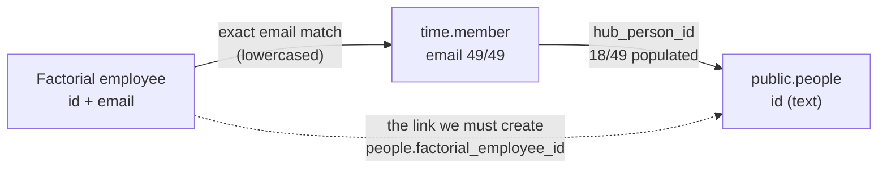
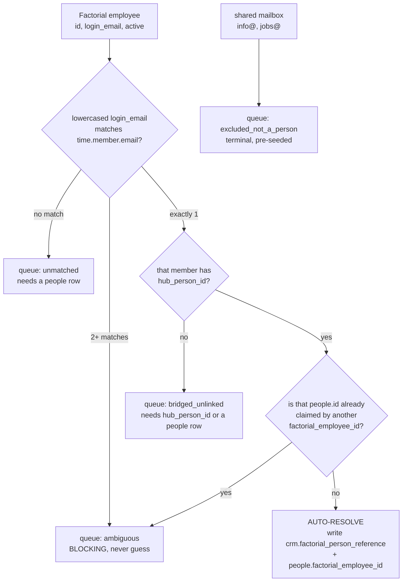
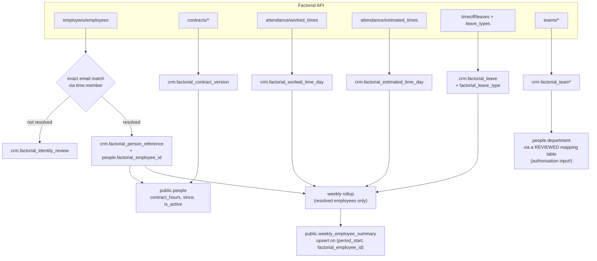

# Factorial HR API — integration reference for the HSE platform

Status: research + design. **No implementation code and no database changes are part of this document.**
Researched 2026-08-26 against API version `2026-07-01`.

Every factual claim about the API cites its source URL. Where the docs do not state
something, this document says **not documented** instead of guessing. Every claim about
our own database was read from the live DB read-only (`begin read only`, always rolled
back) on 2026-08-26 and is marked `[live DB]`.

> **Corrections to the brief.** Three premises in the task brief are wrong against the live
> DB, and the design below is built on the live values, not the brief:
>
> | Brief said | Live DB actually has |
> | --- | --- |
> | `time.member` `hub_person_id` null for all 49 | **18 of 49 populated**, all 18 pointing at real `people.id` values |
> | `time.member` `user_id` populated for 3 | **19 of 49 populated** |
> | `weekly_employee_summary` has 12 columns | **18 columns** — 6 more than the brief lists (see §9.1) |
> | (implied) `people` has an email column | **`people` has NO email column.** This is the single most important structural fact in this document — see §6. |
>
> Also: the 2 shared mailboxes are `info@` and `jobs@` as stated, but the non-`@hs-experts.com`
> addresses number **5 across 4 foreign domains**, and one of them is a lookalike typo domain.

---

## 1. Authentication

### 1.1 The two methods

Factorial offers exactly two authentication methods: **API Keys** and **OAuth2**.
Source: <https://apidoc.factorialhr.com/docs/authentication>

| | API Key | OAuth2 user token | OAuth2 company token |
| --- | --- | --- | --- |
| Header | `x-api-key: <KEY>` | `Authorization: Bearer <TOKEN>` | `Authorization: Bearer <TOKEN>` |
| Lifetime | **never expires** | **1 hour** | **never expires** (revocable) |
| Refresh token lifetime | n/a | **1 week**, then full re-auth | n/a |
| Scope of access | **TOTAL ACCESS to everything**, not customisable | limited to OAuth scopes ∩ the user's own permission group | limited to OAuth scopes, not tied to a user |
| Acts on behalf of | the company (no user attribution) | the user | the company |
| Allowed for our case | yes — "internal company integrations are still supported" | yes | yes |

Sources, claim by claim:

- Header name `x-api-key`, value with no prefix, keys have "TOTAL ACCESS to everything and
  never expire", generated by an admin in the UI:
  <https://apidoc.factorialhr.com/docs/api-keys>
- API key cannot be restricted/customised; the alternative for customised access is OAuth2:
  <https://apidoc.factorialhr.com/docs/faqs>
- API keys for **marketplace** integrations are deprecated; internal company integrations
  are still supported: <https://apidoc.factorialhr.com/docs/authentication>
- OAuth2 bearer header is `Authorization` prefixed with `Bearer ` and a space:
  <https://apidoc.factorialhr.com/docs/oauth-2>
- User tokens last 1 hour: <https://apidoc.factorialhr.com/docs/oauth-2> and
  <https://apidoc.factorialhr.com/docs/request-an-access-token>
- Refresh token lasts 1 week, after which the whole flow restarts:
  <https://apidoc.factorialhr.com/docs/refreshing-an-access-token>
- Company tokens do not expire but can be revoked:
  <https://apidoc.factorialhr.com/docs/oauth-2>
- Company tokens are obtained with `resource_owner_type=company` on the authorize URL, and
  "avoid problems tied to user permissions and the company's employee continuity and
  besides, it never expires": <https://apidoc.factorialhr.com/docs/request-an-authorization-code>
- OAuth2 returns `null` on properties the granting user's permission group cannot see:
  <https://apidoc.factorialhr.com/docs/faqs>
- The API key is JWT-formatted but must still be sent as `x-api-key`, **not** as a bearer
  token: <https://apidoc.factorialhr.com/docs/sdks-overview>
- The OpenAPI spec confirms both schemes and that every endpoint we need accepts either
  (`security: [{oauth2:[]},{apikey:[]}]`, `apikey` = `{type: apiKey, in: header, name: x-api-key}`):
  <https://api.factorialhr.com/oas/?version=2026-07-01>

### 1.2 Decision: use an OAuth2 **company** token

**For our server-side scheduled sync, use an OAuth2 company token. Not an API key, and not a
user token.** Reasoning, in priority order:

1. **Least privilege is achievable, and it is not with an API key.** An API key has "TOTAL
   ACCESS to everything" and "cannot be customized"
   (<https://apidoc.factorialhr.com/docs/api-keys>, <https://apidoc.factorialhr.com/docs/faqs>).
   This is German employee data including salary, bank account, social security number and
   disability percentage — all fields present on `employees_employee` and
   `contracts_contract_version` in the spec. A credential that can read all of that, when we
   need seven scopes, cannot be defended under GDPR Art. 5(1)(c) data minimisation. A company
   token is restricted to the scopes configured on the OAuth application
   (<https://apidoc.factorialhr.com/docs/oauth-scopes>).
2. **It never expires, so a nightly cron has no refresh failure mode.** Company tokens do not
   expire (<https://apidoc.factorialhr.com/docs/oauth-2>). A **user** token would be
   unworkable here: it lives 1 hour and its refresh token lives only 1 week
   (<https://apidoc.factorialhr.com/docs/refreshing-an-access-token>), so any sync outage
   longer than 7 days requires a human to redo an interactive browser consent. That is a
   guaranteed 3am page.
3. **It survives staff turnover.** A user token is bound to an employee who may be
   terminated; Factorial explicitly markets company tokens as avoiding problems "tied to
   user permissions and the company's employee continuity"
   (<https://apidoc.factorialhr.com/docs/request-an-authorization-code>).
4. **It avoids silent nulls.** With a user token, fields outside the granting user's
   permission group come back as `null` rather than erroring
   (<https://apidoc.factorialhr.com/docs/faqs>). Silent nulls in a contract-hours feed would
   corrupt utilisation denominators with no error to alert on — exactly the failure this repo's
   honest-nulls rule exists to prevent.
5. **Revocability.** A company token can be revoked (<https://apidoc.factorialhr.com/docs/oauth-2>),
   which is the incident-response story a never-expiring all-access API key does not have.
6. Factorial itself recommends "an OAuth 2.0 company token" for time-tracking integrations,
   and makes it mandatory for partner integrations:
   <https://apidoc.factorialhr.com/docs/time-tracking-integrations>. We are an internal
   integration, so it is a recommendation for us rather than a requirement, but it is the
   same shape of workload.

Cost of this decision, stated honestly: obtaining the token is a one-off interactive step
(a browser consent by a Factorial admin), and **the scope list cannot be changed later
without invalidating every already-issued token** — "If you change the scopes in an already
existing OAuth app, the already-generated tokens will become invalid so the client will need
to re-authorize" (<https://apidoc.factorialhr.com/docs/oauth-scopes>). So the scope list in
§1.4 must be agreed **before** the first authorization, not discovered incrementally.

### 1.3 The company-token flow, exactly

1. An admin creates the OAuth application at <https://api.factorialhr.com/oauth/applications>,
   selecting the scopes from §1.4 and registering our redirect URI.
   Source: <https://apidoc.factorialhr.com/docs/request-an-access-token> (where CLIENT_ID,
   CLIENT_SECRET and REDIRECT_URI come from) and
   <https://apidoc.factorialhr.com/docs/first-steps>.
2. Send the admin to the authorize URL **with `resource_owner_type=company`**:

   ```text
   https://api.factorialhr.com/oauth/authorize
     ?client_id=<CLIENT_ID>
     &redirect_uri=<REDIRECT_URI>
     &response_type=code
     &resource_owner_type=company
     &scope=employees%20contracts%20time_tracking%20time_off%20company_legal_entities%20company_holidays
     &state=<CSRF_NONCE>
   ```

   `resource_owner_type=company`, `state`, and the scope-in-URL form are all documented:
   <https://apidoc.factorialhr.com/docs/request-an-authorization-code> and
   <https://apidoc.factorialhr.com/docs/oauth-scopes>.
3. Exchange the code, once (a code is single-use — "You can generate only one OAuth2 token
   with the same code"):

   ```bash
   curl -X POST 'https://api.factorialhr.com/oauth/token' \
     -d 'client_id=<CLIENT_ID>&client_secret=<CLIENT_SECRET>&code=<CODE>&grant_type=authorization_code&redirect_uri=<REDIRECT_URI>'
   ```

   Source: <https://apidoc.factorialhr.com/docs/request-an-access-token>
4. The response shape is documented as:

   ```json
   {
     "access_token": "de6780bc...",
     "token_type": "Bearer",
     "expires_in": 7200,
     "refresh_token": "8257e65c...",
     "scope": "read write",
     "created_at": 1680013957
   }
   ```

   Source: <https://apidoc.factorialhr.com/docs/request-an-access-token>

   **Discrepancy worth noting:** this example shows `expires_in: 7200` (2 hours) while the
   prose on the same page and on <https://apidoc.factorialhr.com/docs/oauth-2> both say user
   tokens last 1 hour. The doc does not reconcile the two. For a **company** token the prose
   says it does not expire; what `expires_in` contains for a company token is **not
   documented**. Treat `expires_in` as authoritative at runtime and implement the refresh path
   in §1.5 defensively regardless.
5. Confirm what you actually got before trusting it. `GET /api/2026-07-01/resources/api_public/credentials`
   returns the token owner, which is how you verify you hold a company token and not a user
   token. Sources: <https://apidoc.factorialhr.com/docs/request-an-access-token> ("Checking
   access token ownership") and the spec path `/api/2026-07-01/resources/api_public/credentials`.
6. Store `access_token`, `refresh_token`, `expires_in`, `created_at` and the granted `scope`
   server-side only (see §11 for where).

### 1.4 Scopes required, per endpoint we need

Scopes are declared per OAuth application and are **read and write together** — "Currently,
our scopes allow both read and write actions within the resources." There is no read-only
variant. Source: <https://apidoc.factorialhr.com/docs/oauth-scopes>

| Scope | Unlocks (of what we need) |
| --- | --- |
| `employees` | `Employees > Employee`, **and also `Teams > Team` + `Teams > Membership`** |
| `contracts` | `Contracts > ReferenceContract`, `ContractVersion`, `Compensation`, `GermanContractType`, `ContractTemplate`, `Taxonomy` |
| `time_tracking` | `Attendance > Shift`, `WorkedTime`, `EstimatedTime`, `OpenShift`, `OvertimeRequest`, `EditTimesheetRequest`, `BreakConfiguration`, `WorkSchedule > *`, `TimePlanning > PlanningVersion` |
| `time_off` | `Timeoff > Leave`, `LeaveType`, `Allowance`, `AllowanceStat`, `AllowanceIncidence`, `Policy`, `PolicyAssignment`, `PolicyTimeline`, `BlockedPeriod` |
| `company_legal_entities` | `Companies > Legal Entities` |
| `company_holidays` | `Holidays > CompanyHoliday` (needed to compute expected hours correctly) |

Source for the whole table: the scope→endpoint mapping at
<https://apidoc.factorialhr.com/docs/oauth-scopes>

Two things to flag to whoever clicks the consent screen:

- **`employees` is a wide scope.** It is the only scope that grants Teams, so we cannot get
  team structure without it. The `employees_employee` payload includes
  `bank_number`, `swift_bic`, `social_security_number`, `identifier` (national ID),
  `disability_percentage_cents`, `birthday_on`, `nationality` and home address
  (source: `employees_employee` schema in <https://api.factorialhr.com/oas/?version=2026-07-01>).
  We need almost none of it. See §11 for the mitigation (field allow-list at ingest).
- **`contracts` carries salary.** `contracts_contract_version` includes `salary_amount`
  (in cents) and `salary_frequency`, and the scope also unlocks `Contracts > Compensation`
  (same source). We need `working_hours` and dates from this endpoint, not pay. **Do not
  request `contracts` and then ingest salary "because it was in the response."**

**Explicitly NOT requested:** `payroll`, `banking`, `performance`, `employee_updates`,
`trainings`, `company_locations`. Compensation data (§7.5) is deliberately deferred to a
human decision (§11, Q4) rather than scoped now, because scope changes invalidate tokens.

### 1.5 Refresh flow

Only needed for user tokens, and we are not using one — but implement it anyway as a
fallback, because a misconfigured consent can silently yield a user token.

```bash
curl -X POST 'https://api.factorialhr.com/oauth/token' \
  -d 'client_id=<ID>&client_secret=<SECRET>&refresh_token=<REFRESH>&grant_type=refresh_token'
```

Source: <https://apidoc.factorialhr.com/docs/refreshing-an-access-token>

Facts that shape the implementation:

- Every new token issue also issues a **new** refresh token, so the stored refresh token must
  be replaced on each refresh: <https://apidoc.factorialhr.com/docs/request-an-access-token>
- The refresh token is valid **1 week**. Past that, the interactive authorize flow must be
  redone from scratch: <https://apidoc.factorialhr.com/docs/refreshing-an-access-token>
- Therefore: if the sync ever finds itself holding a user token, it must alarm loudly rather
  than degrade quietly, because the clock to unrecoverable-without-a-human is 7 days.

Whether refresh-token rotation invalidates the previous refresh token immediately is **not
documented**. Whether a company token can be refreshed at all is **not documented**.

---

## 2. Versioning and base URLs

### 2.1 Current version string

**`2026-07-01`** is the current stable version and what we should pin. Confirmed three ways:

- `https://api.factorialhr.com/oas/?version=2026-07-01` returns `info.version: "2026-07-01"`
  with 383 paths and 160 schemas (fetched 2026-08-26).
- The scope documentation links all endpoints as `/v2026-07-01/reference/...`:
  <https://apidoc.factorialhr.com/docs/oauth-scopes>
- The TypeScript SDK's current major maps to it: SDK `2.x.y` ↔ API `2026-07-01`:
  <https://apidoc.factorialhr.com/docs/sdks-overview>

`2026-10-01` exists but is labelled **Beta**:
<https://apidoc.factorialhr.com/docs/api-versioning>. Do not pin to it.

### 2.2 How versions are pinned

The version is a path segment: `/api/{VERSION}/resources/{domain}/{resource}`, e.g.
`/api/2026-07-01/resources/employees/employees`. Source: the path list in
<https://api.factorialhr.com/oas/?version=2026-07-01>, and
<https://apidoc.factorialhr.com/docs/time-tracking-integrations> ("Endpoints are versioned
(`/api/YYYY-MM-DD/...`)").

The support policy, which sets our upgrade cadence:

- New version at the **beginning of each quarter** (Jan/Apr/Jul/Oct).
- Each version is supported for **one year**.
- That leaves **9 months** to migrate.
- After support ends, requests to an unsupported version "will be served using the oldest
  version schema" — i.e. it does not 404, it **silently serves a different schema**. This is
  the dangerous failure mode and is the reason for the gate in §10, Phase 0.

Source: <https://apidoc.factorialhr.com/docs/api-versioning>

Note some doc pages still show older or unversioned paths in examples: `/api/v2/resources/...`
(<https://apidoc.factorialhr.com/docs/manage-webhooks>) and `/api/2024-10-01/...`
(<https://apidoc.factorialhr.com/docs/first-steps>). Ignore those; use `2026-07-01` everywhere.

### 2.3 Base URLs

| Environment | Base URL | Notes |
| --- | --- | --- |
| Production | `https://api.factorialhr.com` | app at <https://app.factorialhr.com/> |
| Demo (current) | `https://api.eu2.demo.factorial.dev` | app at <https://app.demo.factorial.dev/> |
| Demo (old) | `https://api.demo.factorial.dev` | marked **"Demo server (deprecated)"** in the spec |

Sources: <https://apidoc.factorialhr.com/docs/production-and-demo> for the environment pair,
and the `servers` block of <https://api.factorialhr.com/oas/?version=2026-07-01> for all
three URLs and the deprecation label. The docs themselves are inconsistent here —
`first-steps` and `request-an-authorization-code` still tell you to use the deprecated
`api.demo.factorial.dev`. Prefer the `eu2` host.

### 2.4 Demo environment for testing

- Both environments run **the same code**, deployed at the same time: "Everything that works
  in a demo environment should work in production."
- Demo data "can be deleted at any moment."
- **Credentials are not portable**: demo credentials against the demo host, production
  credentials against production. Mixing them yields **empty responses, not an auth error** —
  which would look exactly like "the company has no employees." Any gate that reads 0 rows
  must therefore distinguish "empty" from "wrong environment."
- Getting a demo environment is **not self-service**: "Contact your account manager or
  account executive to request this environment and get Oauth credentials."
- All endpoints in the docs are available in the sandbox.

Sources: <https://apidoc.factorialhr.com/docs/production-and-demo>,
<https://apidoc.factorialhr.com/docs/first-steps>, <https://apidoc.factorialhr.com/docs/faqs>

Consequence for our plan: **Phase 1 cannot start until someone requests the demo tenant**
(§11, Q1). Until then, the only lawful place to test is production, read-only, which is
acceptable for `GET`s but not for the webhook work in §8.

### 2.5 Machine-readable spec

The OpenAPI spec is fetchable and version-pinnable:

- Latest: <https://api.factorialhr.com/oas/>
- Pinned: `https://api.factorialhr.com/oas/?version=2026-07-01`

Source: <https://apidoc.factorialhr.com/docs/faqs>

This is what makes the Phase 0 drift gate in §10 cheap: diff the spec, not the prose.

Status page, for distinguishing our bugs from theirs: <https://status.factorialhr.com/>
(source: <https://apidoc.factorialhr.com/docs/faqs>).

---

## 3. Pagination contract

**Cursor pagination is the default and only documented type.** Source:
<https://apidoc.factorialhr.com/docs/pagination>

### 3.1 Parameters

| Param | Type | Meaning |
| --- | --- | --- |
| `limit` | Integer | Page size. **Default 100, and 100 is also the maximum.** Absent or above max ⇒ max is used. |
| `after_id` | cursor | Return only items **after** this cursor. |
| `before_id` | cursor | Return only items **before** this cursor. |

Sorting is **by ID ascending**. All of the above: <https://apidoc.factorialhr.com/docs/pagination>

Two traps:

- The parameters are named `after_id` / `before_id` but the values are **opaque cursors**, not
  integer ids — the doc's own example is `after_id=MTY=`, which is base64. Treat them as
  opaque strings; never construct, increment or compare them.
- **These three parameters do not appear anywhere in the OpenAPI spec.** I checked: the
  strings `after_id` and a `limit` query parameter are absent from
  <https://api.factorialhr.com/oas/?version=2026-07-01>. So the pagination contract is
  documented **only** in prose, and the generated SDKs are the only machine-checked
  implementation of it. This is a real risk: a spec-diff gate will not catch a pagination
  change. Rely on the runtime gate in §10, Phase 1 instead.

### 3.2 Response envelope

```json
{
  "meta": {
    "has_next_page": true,
    "has_previous_page": false,
    "start_cursor": "MTc=",
    "end_cursor": "Mjc=",
    "total": 85,
    "limit": 10
  },
  "data": [ ... ]
}
```

Source: <https://apidoc.factorialhr.com/docs/pagination>. The spec corroborates the envelope:
every list operation returns `{data: [<resource>], meta: _paged_index_meta}`, and
`_paged_index_meta` has exactly `start_cursor`, `end_cursor`, `has_previous_page`,
`has_next_page`, `limit`, `total`
(<https://api.factorialhr.com/oas/?version=2026-07-01>).

Note the spec marks only 4 of those 6 fields as required, so **`total` and `limit` may be
absent**. Do not use `total` as a loop termination condition; use `has_next_page`.

### 3.3 A correct paging loop

Illustrative only, per the no-implementation-code constraint.

```js
const BASE = "https://api.factorialhr.com";
const VERSION = "2026-07-01";

// Bound the loop. An unbounded while(true) against a paginated API is how you
// get a runaway job when the server starts returning has_next_page forever.
const MAX_PAGES = 500;

async function fetchAllPages(resource, params = {}, token) {
  const rows = [];
  let cursor = null;
  let pages = 0;

  while (pages < MAX_PAGES) {
    const url = new URL(`${BASE}/api/${VERSION}/resources/${resource}`);
    for (const [k, v] of Object.entries(params)) {
      if (v === undefined || v === null) continue;
      // array params use the documented `name[]` repeated form
      if (Array.isArray(v)) for (const item of v) url.searchParams.append(k, item);
      else url.searchParams.set(k, String(v));
    }
    url.searchParams.set("limit", "100");           // documented max
    if (cursor) url.searchParams.set("after_id", cursor); // opaque; never parsed

    const res = await fetch(url, {
      headers: {
        Authorization: `Bearer ${token}`,           // company token, §1.2
        Accept: "application/json",
      },
    });

    // Fail loud. A silent catch here produces a plausible-looking short page,
    // which downstream becomes a plausible-looking wrong utilisation number.
    if (!res.ok) {
      throw new Error(`${resource} page ${pages}: HTTP ${res.status} ${await res.text()}`);
    }

    const body = await res.json();
    const data = body?.data;
    const meta = body?.meta;
    if (!Array.isArray(data) || !meta) {
      throw new Error(`${resource}: unexpected envelope, got keys ${Object.keys(body ?? {})}`);
    }

    rows.push(...data);
    pages += 1;

    if (!meta.has_next_page) return { rows, pages, truncated: false };

    // has_next_page true but no cursor to advance with => stop, do not spin.
    if (!meta.end_cursor || meta.end_cursor === cursor) {
      throw new Error(`${resource}: has_next_page but end_cursor did not advance`);
    }
    cursor = meta.end_cursor;
  }

  // Honest signal, not a silent truncation.
  return { rows, pages, truncated: true };
}
```

Three deliberate choices, each of which maps to a house rule:

- **`truncated` is returned, not swallowed.** A truncated read must never be written into
  `weekly_employee_summary` as if it were complete; that is how a plausible-but-wrong 0
  gets into a utilisation figure.
- **The envelope is validated**, so a future breaking change surfaces as a thrown error at
  sync time rather than as missing rows.
- **`end_cursor` non-advancement is fatal**, because the alternative is an infinite loop
  hammering a rate-limited API.

Note there is no `.order()` / `.range()` concern here — that house rule applies to our
Supabase paged reads, and it does apply to any UI that later pages over
`weekly_employee_summary`. Factorial's own ordering is fixed at ID-ascending and is not
selectable (<https://apidoc.factorialhr.com/docs/pagination>).

### 3.4 SDK alternative

Official SDKs exist and are generated from the same spec:
`@factorialco/api-client` (npm) and `factorial-api-client` (PyPI). The TS SDK offers
`list()` (one page), `paginate()` (async iterator) and `all()` (everything, with a safety cap).
Pin the major to the API version: `2.x.y` ↔ `2026-07-01`.
Source: <https://apidoc.factorialhr.com/docs/sdks-overview>

**Recommendation: do not adopt the SDK for phase 1.** Our scripts are plain `.mjs` run with
`node` and the whole surface we need is 8 `GET`s behind one paging helper. The SDK's value is
typing and the webhook catalog; its cost is a dependency whose major version is coupled to
Factorial's quarterly cadence, on top of a Next.js upgrade this repo is already managing.
Revisit if and when we start **writing** to Factorial. There is also an agent skill
(`npx skills add factorialco/factorial-api-sdks --skill factorial-api-sdks`) which is only
useful if we adopt the SDK: <https://apidoc.factorialhr.com/docs/ai-agents>

---

## 4. Rate limits

**Only one rate limit is documented, and it does not apply to us:**

> "There is a limit of 200 requests per minute for POST requests"

Source: <https://apidoc.factorialhr.com/docs/faqs>

Everything else is **not documented**, and I am stating that rather than inventing numbers:

- A rate limit for **GET** requests: **not documented.** Our sync is entirely GETs, so we
  have **no documented budget at all** for the traffic we actually intend to send.
- `429` status code: **not documented.** The string `429` does not appear anywhere in
  <https://api.factorialhr.com/oas/?version=2026-07-01>, and no endpoint documents a
  rate-limited response.
- `RateLimit-*` / `Retry-After` / `X-RateLimit-*` response headers: **not documented.** No
  rate-limit header appears anywhere in the spec.
- Per-endpoint, per-token or per-company quotas: **not documented.**
- Concurrency limits: **not documented.**
- Webhook delivery rate limits: **not documented** (retry policy is documented — see §8).

Practical consequence, and this is a design constraint not a nicety: because there is no
documented GET budget and no documented signal for exceeding one, the sync must be
**self-limiting by construction** and must **treat any unexpected 4xx/5xx as potentially
rate-limiting**:

- Sequential paging, one request in flight per resource. No fan-out across employees.
- Use the server-side filters (§5) to reduce request count rather than fetching broadly and
  filtering in JS — `employee_ids[]`, `start_on`/`end_on` and `updated_at_gteq` all exist
  precisely for this.
- Exponential backoff with jitter on `429` **and** `5xx`, honouring `Retry-After` if present
  even though it is undocumented.
- Log the observed request count per run, so we can discover the real ceiling empirically
  instead of guessing it. This is the only way we will ever have a number here.
- Before blaming ourselves for 500s, check <https://status.factorialhr.com/>
  (source: <https://apidoc.factorialhr.com/docs/faqs>).

**Open question for Factorial support (§11, Q2): what is the GET rate limit, and is it
signalled?**

---

## 5. Endpoint catalogue we actually need

All paths are prefixed `https://api.factorialhr.com/api/2026-07-01/resources/`.
All are `GET`. All confirmed present in <https://api.factorialhr.com/oas/?version=2026-07-01>;
field lists are from that spec's schemas.

| # | Purpose | Method + path | Key response fields | Scope |
| --- | --- | --- | --- | --- |
| 1 | Employee roster; **the email that anchors identity**; hire/termination dates; legal entity; manager | `GET employees/employees` | `id`, `email`, `login_email`, `communications_email`, `personal_email`, `full_name`, `first_name`, `last_name`, `company_id`, `legal_entity_id`, `manager_id`, `company_identifier`, `active`, `is_terminating`, `terminated_on`, `termination_reason_type`, `seniority_calculation_date`, `attendable`, `updated_at` | `employees` |
| 2 | **Real contract weekly hours** — the fix for the fake uniform 40 | `GET contracts/reference_contracts` | `employee_id`, `working_hours`, `working_hours_frequency`, `working_week_days`, `working_time_percentage_in_cents`, `maximum_weekly_hours`, `max_legal_yearly_hours`, `starts_on`, `ends_on`, `effective_on`, `job_title`, `country`, `bank_holiday_treatment` | `contracts` |
| 3 | Contract **history** (for correct historical weeks, not just today) | `GET contracts/contract_versions` | same schema as #2, plus `created_at`, `updated_at`; filters `employee_ids[]`, `date`, `updated_at_gteq`, `updated_at_lteq` | `contracts` |
| 4 | Clock-in/out detail; per-shift minutes | `GET attendance/shifts` | `id`, `employee_id`, `date`, `clock_in`, `clock_out`, `minutes`, `workable`, `half_day`, `location_type`, `observations`, `in_source`, `out_source`, `updated_at` | `time_tracking` |
| 5 | **Worked time per employee per day** — the aggregate we want | `GET attendance/worked_times` | `id` (composite `employee_id`+`date`), `employee_id`, `date`, `minutes`, `tracked_minutes`, `pending_minutes`, `multiplied_minutes`, `time_unit`, `day_type` (`workday`/`saturday`/`sunday`/`bank_holiday`), `worked_time_blocks` | `time_tracking` |
| 6 | **Expected minutes per employee per day** — the honest utilisation denominator | `GET attendance/estimated_times` | `employee_id`, `date`, `expected_minutes`, `minutes`, `regular_minutes`, `overtime_minutes`, `breaks`, `source` (`shift_management`/`work_schedule`/`contract_hours`/`none`), `time_unit`, `estimated_half_days` | `time_tracking` |
| 7 | **Absences / leave** — who was off and why | `GET timeoff/leaves` | `id`, `employee_id`, `start_on`, `finish_on`, `half_day`, `start_time`, `hours_amount_in_cents`, `days_taken`, `leave_type_id`, `leave_type_name`, `approved`, `description`, `reason`, `deleted_at`, `updated_at` | `time_off` |
| 8 | Leave type semantics — **whether a leave consumes capacity** | `GET timeoff/leave_types` | `id`, `name`, `translated_name`, `identifier`, `workable`, `payable`, `accrues`, `approval_required`, `active`, `color`, `allowance_ids` | `time_off` |
| 9 | Holiday entitlement config | `GET timeoff/allowances` | `id`, `name`, `allowance_type` (`days`/`hours`), `holiday_allowance_in_cents`, `frequency`, `cycle_length`, `cycle_start`, `days_type`, `carry_over_days`, `leave_type_ids`, `timeoff_policy_id`, `proration_type` | `time_off` |
| 10 | Holiday balance per employee — feeds `people.holiday_left` / `total_holiday` | `GET timeoff/allowance_stats` | `employee_id`, `allowance_id`, `year`, `available_days`, `total`, `total_accrued_units`, `used_days`, `used_units_until_reference_date`, `outstanding_units`, `accumulated_carry_over`, `max_balance_cap`, `prorated_allowance_days`; filter `reference_date` | `time_off` |
| 11 | Legal entities (which GmbH employs whom) | `GET companies/legal_entities` | `id`, `company_id`, `legal_name`, `country`, `currency`, `tin`, `city`, `state`, `postal_code`, `address_line_1`, `address_line_2` | `company_legal_entities` |
| 12 | Teams / department structure | `GET teams/teams` | `id`, `name`, `description`, `employee_ids`, `lead_ids`, `company_id` | `employees` |
| 13 | Team membership + **who leads a team** | `GET teams/memberships` | `id`, `employee_id`, `team_id`, `lead`, `company_id`; filters `lead`, `team_ids[]`, `employee_ids[]` | `employees` |
| 14 | Public holidays (so a holiday is not scored as an absence) | `GET holidays/company_holidays` | filters `location_ids[]`, `team_ids[]`, `employee_ids[]`, `start_at`, `end_at` | `company_holidays` |
| 15 | Token owner check (company vs user) — §1.3 step 5 | `GET api_public/credentials` | — | (any) |
| 16 | Compensation, **only if a human approves the scope** (§11 Q4) | `GET contracts/compensations` | `contract_version_id`, `compensation_type`, `amount`, `currency`, `unit`, `recurrence`, `starts_on`, `first_payment_on` | `contracts` |

### 5.1 Server-side filters that matter for request budget (§4)

| Endpoint | Filters available |
| --- | --- |
| `employees/employees` | `ids[]`, `emails[]`, `access_ids[]`, `full_text_name`, `name_starts_with`, `updated_at_gteq`, `legal_entity_ids[]`, `company_identifier`, `team_ids[]`, `location_ids[]`, `only_active`\*, `only_managers`\* |
| `contracts/reference_contracts` | `employee_ids[]`, `job_catalog_tree_node_uuids[]`\* |
| `contracts/contract_versions` | `ids[]`, `employee_ids[]`, `date`, `updated_at_gteq`, `updated_at_lteq`, `job_catalog_tree_node_uuids[]`\* |
| `attendance/shifts` | `employee_ids[]`, `start_on`, `end_on`, `ids[]`, `updated_at`, `workable`, `half_day`\*, `sort_created_at_asc`\*, `last_working_shift`, `latest_shift` |
| `attendance/worked_times` | `start_on`, `end_on`, `employee_ids[]`, `include_time_range_category`\*, `include_non_attendable_employees`\* |
| `attendance/estimated_times` | `start_on`\*, `end_on`\*, `employee_ids[]`\* — **all three required** |
| `timeoff/leaves` | `ids[]`, `employee_ids[]`, `leave_type_id[]`, `from`, `to`, `only_active`, `include_deleted_leaves`\*, `approved`, `include_pending`, `include_leave_type`, `include_duration`, `type_is_workable`, `type_is_payable` |
| `timeoff/allowance_stats` | `ids[]`, `employee_ids[]`, `allowance_ids[]`, `reference_date` |
| `teams/memberships` | `ids[]`, `lead`, `team_ids[]`, `employee_ids[]` |
| `holidays/company_holidays` | `ids[]`, `location_ids[]`, `team_ids[]`, `employee_ids[]`, `start_at`, `end_at` |

`*` = the spec marks this parameter `required: true`. **Treat this with suspicion.** The spec
marks `only_active` and `only_managers` as required on `employees/employees`, and
`job_catalog_tree_node_uuids[]` as required on `reference_contracts` — which would make the
plain "list all employees" call impossible without them, and which contradicts both the SDK
example (`client.employees.employees.list()` with no arguments,
<https://apidoc.factorialhr.com/docs/sdks-overview>) and the doc's own guidance to "Fetch
employees via `GET /employees/employees`" (<https://apidoc.factorialhr.com/docs/time-tracking-integrations>).
Whether these are genuinely required is **not documented in prose**; the spec's `required`
flags on query params here look like a generator artefact. **Phase 1's first gate must
empirically determine which of these are actually mandatory** (§10).

### 5.2 Notes on specific endpoints

**`reference_contracts` semantics matter.** "The reference contract is the contract that
applies today. If no contract applies today, we will return the nearest upcoming contract.
If there are no upcoming contracts, we will provide the most recent past contract."
Source: <https://apidoc.factorialhr.com/reference/get_api-2026-07-01-resources-contracts-reference-contracts>

This is a **today-shaped** answer. It is correct for "what is this person's contract now" and
**wrong for backfilling historical weeks** — a person who went from 40h to 20h in June will
have their January weeks scored against 20h if you use reference contracts alone. For
historical weeks use `contracts/contract_versions` with `date` / `effective_on` and pick the
version in force during the week. And note the fallback behaviour means a terminated
employee still returns a contract (their last one), so **never infer "employed" from the
presence of a reference contract**; use `employees.active` / `terminated_on`.

**`working_hours` needs `working_hours_frequency` to mean anything.** The field is described
only as "the amount of hours the employee works", with frequency in a separate field whose
enumerated values are **not documented** in the spec (it is a bare `string`). So we cannot
assume `working_hours` is weekly. The Phase 2 gate must assert the observed frequency values
and reject rows whose frequency we have not explicitly handled — rather than defaulting to
"weekly" and silently reintroducing a fake number, which is precisely the bug we are fixing.

**`worked_times` vs `shifts`.** `worked_times` is the per-employee-per-day aggregate with a
composite id of `employee_id`+`date`, and is what `weekly_employee_summary.worked_minutes`
should be built from. `shifts` is the raw clock event detail; fetch it only for drill-down or
dispute resolution. `worked_times` also carries `day_type`, which distinguishes a `workday`
from a `bank_holiday` — needed so a holiday is not counted as a zero-worked day.

**`estimated_times` is the single most valuable endpoint here.** `expected_minutes` is
documented as "Amount of minutes the employee has to work **without** taking into
consideration time off leaves and bank holidays", while `minutes` is "Amount of minutes the
employee has to work". Those are two different denominators and the distinction is exactly
what a utilisation figure hinges on. `source` tells you whether the number came from
`contract_hours`, `work_schedule`, `shift_management` or `none` — and **`none` must map to a
NULL denominator, never to 0**. Note all three of its filters are required, so it must be
called per date-range with an explicit employee list.

**`timeoff/leaves` has three flags that change the answer.** `approved` (filter and field),
`include_pending`, and `include_deleted_leaves` (marked required). A pending leave request is
not an absence yet; a deleted one never was. Decide the policy explicitly (§11, Q5) and
encode it in the gate, because the default is undocumented.

**Leave duration is awkward.** `hours_amount_in_cents` ("total number of hours taken for the
leave, represented in cents") and `days_taken` ("Number of days taken for paid leave") and
`half_day` and `start_time` all coexist. Converting a leave to minutes for
`absence_minutes` therefore requires the employee's contract hours **and** the leave type's
`workable` flag. A full-day absence is not "8 hours" for a 20h/week employee. Do not
hardcode a working day length.

---

## 6. THE IDENTITY PROBLEM

This is the part that decides whether the integration is trustworthy, so it is the longest
section.

### 6.1 The actual current state `[live DB, 2026-08-26]`

```
public.people                      26 rows
  factorial_employee_id populated   0
  trackingtime_user_id  populated   0
  UNIQUE (factorial_employee_id)    exists
  NO EMAIL COLUMN                   <-- confirmed against information_schema
  source = 'seed' for all 26 rows   <-- every row is seed data
  is_active = false for 8 (emp-1..emp-8), true for 18 (md-*)

time.member                        49 rows
  email                            49/49 populated
  hub_person_id                    18/49 populated (all 18 resolve to a real people.id)
  user_id                          19/49 populated
  weekly_hours = 40.00             49/49  <-- the TrackingTime assumption, not contract truth
  is_archived = true               ~29

public.weekly_employee_summary      0 rows, 18 columns
  UNIQUE (period_start, factorial_employee_id)
  factorial_employee_id  NOT NULL   <-- structural consequence, see 6.6
  person_id -> people(id) ON DELETE SET NULL

crm.factorial_person_reference      0 rows
  UNIQUE (source_system, external_id, entity_type, account_ref)
  person_id -> people(id) ON DELETE CASCADE
  CHECK source_system='factorial', CHECK entity_type='person'
  RLS: 1 policy, ALL, authenticated, USING app_user_role()='exec'

time.entry                       5367 rows, 2026-01-01 .. 2026-12-31
  rows dated after today (2026-08-26): 257  (= 592.2 hours of planned future time)
```

### 6.2 `public.people` has no email column. This is the crux.

There is no email column on `people`. Verified twice: the full column list of `people` (25
columns, no email), and a repo-wide scan showing the only email-ish columns in
`public`/`time`/`crm` are `crm.lexware_customer.contact_email`,
`public.budget_alert_feed.email_state` (a state enum, not an address), `time.member.email`
and `time.org_chart.email`.

So the join **cannot** be `Factorial.email = people.email`. The brief's framing of "email is
the only real candidate key" is right about email being the only candidate, but the key does
not exist on both sides. What we actually have is a two-hop path:



Read that carefully: **`time.member` is the only email-bearing bridge to `people`, and it
only bridges for the 18 rows where `hub_person_id` is already set.** For the other 31
members, a Factorial email can be matched to a `time.member` row but the chain dead-ends
before reaching `people`.

That gives four honest outcomes for any Factorial employee, and **only outcome A may be
written automatically**:

| Outcome | Condition | Action |
| --- | --- | --- |
| **A. Resolved** | exact lowercased email match to exactly one `time.member` row, and that row has a non-null `hub_person_id` | write the mapping |
| **B. Bridged but unlinked** | exact email match to a `time.member` row whose `hub_person_id` is NULL | **review queue.** We know who they are in TrackingTime and not in the hub. Needs a `people` row or a `hub_person_id`. |
| **C. Unmatched** | no `time.member` row with that email | **review queue.** Almost certainly a real employee who never used TrackingTime. Needs a new `people` row. |
| **D. Ambiguous** | more than one `time.member` row matches, or two Factorial employees resolve to the same `people.id` | **review queue, blocking.** Never guess. |

Rough expectation, stated as an expectation and not a fact because we have not yet seen the
Factorial roster: at most 18 of Factorial's employees can land in outcome A. The 8
`emp-1..emp-8` rows are inactive seed data with no member link at all and will never resolve.

### 6.3 Which email field? Factorial has four.

`employees_employee` exposes `email` ("personal email of the employee"), `login_email`
("email associated to the session"), `personal_email` ("personal email of the employee") and
`communications_email` ("Confirmed email address for company communications and
notifications. Separate from login email"), plus `unconfirmed_communications_email`.
Source: `employees_employee` schema, <https://api.factorialhr.com/oas/?version=2026-07-01>

`time.member.email` is the address the person signed into TrackingTime with, which is a work
address. So **`login_email` is the best candidate**, with `communications_email` second and
`email`/`personal_email` explicitly **excluded** — matching on a personal Gmail address would
be both unreliable and a data-minimisation problem.

Which of these is actually populated in our tenant is **unknown until we can read the
production roster**, and it is Q3 in §11. The matcher must therefore try a documented,
ordered list of fields and **record which field produced each match**, so that a match on a
weaker field is visible and auditable rather than invisible.

### 6.4 The specific problem addresses `[live DB]`

**The 5 non-`@hs-experts.com` addresses.** There are 5, spread over 4 foreign domains:

| `time.member` email | display_name | archived | `hub_person_id` | entries | What it is |
| --- | --- | --- | --- | --- | --- |
| `daniel@hsehealthsafetyexpertsgmbh.onmicrosoft.com` | Daniel Hohls | yes | null | 0 | **Duplicate identity.** `daniel@hs-experts.com` also exists (member 5, also archived, also unlinked). Same human, two member rows. |
| `numaninam01@gmail.com` | Numan Inam | yes | null | 0 | Personal address. Contractor or a self-signup. |
| `schoenemann.consulting@gmail.com` | schoenemann.consulting | yes | null | 0 | Personal/consulting address; surname collides with 3 employed Schönemanns (Björn, Simone, Ulf). |
| `ulf63@gmx.net` | ulf63 | yes | null | 0 | Personal address, plausibly the same human as `ulf@hs-experts.com` → `md-ulf`. **Plausibly. Not provably.** |
| `stefan-external@hs-expert.com` | Stefan Goelzner | **no** | null | **62** | **`hs-expert.com`, not `hs-experts.com`** — a one-character-different lookalike domain. Active, still logging time (last entry 2026-08-27). |

What happens to each: **exactly nothing automatic.** All 5 fail the exact-email match against
Factorial's work addresses, so all 5 land in **outcome C** and go to the review queue. Three
specific dangers, all of which the house rule against name similarity exists to prevent:

- `ulf63@gmx.net` and `ulf@hs-experts.com` → **never** auto-merge on the `ulf` prefix or on
  `display_name`. If they are the same person, a human says so once and we store the decision.
- `schoenemann.consulting@gmail.com` against three employed Schönemanns is the textbook case
  where name similarity produces a confidently wrong answer. It could equally be a company,
  not a person.
- `stefan-external@hs-expert.com` is the dangerous one, because it is **active with 62
  entries** and the domain differs from the corporate domain by one letter. A naive
  "corporate domain" heuristic drops him silently; a naive normaliser that "fixes" the typo
  merges him with a `hs-experts.com` identity that may not exist. He is also the only one of
  the five who is not archived, so he is the only one whose exclusion changes current numbers.
  He needs a human decision: employee, external contractor, or neither.

**The 2 shared mailboxes.** Both exist and both are the poison case:

| email | display_name | archived | entries |
| --- | --- | --- | --- |
| `info@hs-experts.com` | "Freelancer HSE Health & Safety Experts" | yes | 0 |
| `jobs@hs-experts.com` | "Jobs Team" | yes | 0 |

These are **not people**. `info@` is explicitly a freelancer-pool bucket and `jobs@` is
recruiting. They must be **permanently and explicitly excluded**, not merely left unmatched,
because "unmatched" invites a future well-meaning engineer to match them. Concretely: seed
them into the review queue with a terminal status (`excluded_not_a_person`) and a reason, so
the exclusion is a recorded decision with an author rather than an accident. If Factorial
ever has an employee whose `login_email` is `info@hs-experts.com`, that is a data-quality
problem in Factorial and must fail loudly.

**Factorial email ≠ TrackingTime email.** This is the largest expected bucket and the reason
this whole section exists. TrackingTime's addresses are inconsistent in form: some are
first-name (`hitul@`, `seif@`, `kurt@`), some are firstname.lastname
(`bjoern.schoenemann@`, `thorsten.krause@`, `mustafa.elnabulsieh@`, `julian.winkelmann@`),
and there is at least one first-name/full-name collision pair (`mustafa@hs-experts.com` =
Mustafa Kaan Kartal, archived, versus `mustafa.elnabulsieh@hs-experts.com` = Mustafa
Elnabulsieh, active, `md-mustafa`). If Factorial uses the other convention for a given
person, exact matching **correctly** returns nothing.

The temptation is to normalise: strip dots, try `firstname@`, try `firstname.lastname@`,
compare local parts, compare display names. **Reject all of it.** With a `mustafa@` /
`mustafa.elnabulsieh@` pair already live, local-part heuristics have a demonstrated
opportunity to attach one human's contract hours and absences to another human's timesheet.
The blast radius is not cosmetic: it is wrong utilisation on a named individual, and under
GDPR it is an accuracy failure (Art. 5(1)(d)) on employee data. Exact match, or a human
decides. That is the rule.

Additionally, 4 members have logged time but no `hub_person_id` and so cannot be attributed
at all today: `pablo@` (427 entries), `kamila@` (111), `stefan-external@` (62), `liliia@` (2).
Three are archived; `stefan-external@` is not. Whatever we build must report these as a
visible count rather than absorbing 602 entries of unattributed work into silence.

### 6.5 Proposed design: resolution with a review queue

Two principles: **the automatic path only ever does exact-key matching**, and **every
non-automatic outcome is a durable row a human can act on**, never a log line.



Rules that make this safe:

1. **Exact match only**, on `lower(trim(email))`. No dot-stripping, no local-part comparison,
   no `display_name` comparison, no Levenshtein, no "confidence score". The queue's
   `match_method` column records which email field matched so that a match is auditable.
2. **One-to-one is enforced by the database, not by the script.** `people.factorial_employee_id`
   already carries `UNIQUE` `[live DB]`, so a second Factorial employee claiming the same
   person fails at insert. `crm.factorial_person_reference` already carries
   `UNIQUE (source_system, external_id, entity_type, account_ref)` `[live DB]`. Let the
   constraints be the enforcement.
3. **Auto-resolve is only outcome A.** Everything else is a queue row. The sync never invents
   a `people` row, because `people.id` is a human-meaningful text key (`md-hitul`, `emp-3`)
   and machine-minting those would poison it.
4. **Queue rows are idempotent and re-evaluated every run.** Keyed on
   `factorial_employee_id`. A run updates `last_seen_at` and re-checks whether an
   unresolved row has become resolvable (e.g. someone set a `hub_person_id`), and
   **auto-closes** it if so. A queue that only grows gets ignored.
5. **A human decision is durable and survives re-sync.** Once someone marks a row
   `excluded_not_a_person` or maps it explicitly, later runs must not re-open it or
   second-guess it. This is what makes the `info@`/`jobs@` exclusions permanent.
6. **Manual mappings are first-class, not overrides.** A human-created mapping is written
   the same way as an automatic one, distinguished by `match_method='manual'` plus
   `reviewed_by` / `reviewed_at`. This mirrors the `review_status` / `review_reason` /
   `reviewed_by` / `reviewed_at` pattern already used by `crm.legal_entity` `[live DB]`.
7. **Unresolved means NULL, never 0.** An employee sitting in the queue produces no
   `weekly_employee_summary` row at all. It must never produce a row with `worked_minutes=0`
   or `expected_minutes=0` — a fabricated zero here reads as "this person did nothing", which
   is both wrong and, about a named employee, defamatory-by-dashboard.
8. **The gate is a ratio, and it is honest.** Every phase reports resolved / queued /
   excluded as three separate counts, plus the total Factorial headcount. "26 of 31 resolved,
   5 queued" is a usable state; "26 resolved" alone is a lie by omission.

### 6.6 A structural warning about `weekly_employee_summary`

`weekly_employee_summary.factorial_employee_id` is **NOT NULL** and participates in the
unique key `(period_start, factorial_employee_id)` `[live DB]`, while `person_id` and
`trackingtime_user_id` are nullable.

Read the consequence: **this table cannot hold a week for a person who has no Factorial
employee id.** It is Factorial-anchored by construction. That is a defensible design (it is
"the FactorialHR feed", per the comment in `scripts/audit-netflix-and-factorial.mjs`), but it
means:

- TrackingTime-only workers — including `stefan-external@` with 62 entries and the 3 archived
  members with 540 entries between them — **have no representation in this table at all.**
  Their logged hours cannot appear here. If the product needs them, that is a schema change
  and a human decision (§11, Q6), not something the sync can paper over.
- The unique key is weekly-per-employee, so the sync's write must be an upsert on
  `(period_start, factorial_employee_id)`, and `period_end` must be derived rather than
  independently keyed.
- `person_id` being nullable with `ON DELETE SET NULL` means a row can outlive its `people`
  link. Any consumer must handle `person_id IS NULL` — and the existing RLS policy on this
  table joins through `people.factorial_employee_id`, so **a row whose employee is not linked
  into `people` is visible only to `exec`** and invisible to `dept_head` and to the person
  themselves. That is a correctness issue for the UI, not just an aesthetic one.

### 6.7 Bounding "hours logged" at today

`time.entry` holds 257 rows dated after 2026-08-26, totalling 592.2 hours of planned future
time, with a max date of 2026-12-31 `[live DB]`. Note the column is `started_at`
(`timestamptz`), **not** `date`.

So any "hours logged" figure must bound at today: `where started_at::date <= current_date`.
The same discipline applies to the Factorial side — `timeoff/leaves` returns approved future
leave, and `allowance_stats` deliberately separates `used_units_until_reference_date`
("excludes future approved leaves") from `outstanding_units` ("Pending units scheduled
(approved in the future) not yet counted as used")
(<https://api.factorialhr.com/oas/?version=2026-07-01>). Use the former for "what has
happened", the latter for "what is booked". Conflating them inflates absence and deflates
utilisation.

For a **current, incomplete** week, `expected_minutes` should be prorated to elapsed working
days or the week marked partial. Comparing a half-finished week's worked minutes against a
full week's expectation manufactures a 50% utilisation figure that is pure artefact.

---

## 7. What Factorial gives us that TrackingTime cannot

### 7.1 Real contract weekly hours — the headline fix

Today: `time.member.weekly_hours = 40.00` for **all 49 members** `[live DB]`. That is a
TrackingTime default, not contract truth, and every utilisation percentage computed from it
is wrong for every part-time employee, every working student and every mid-year contract
change. `time.member` already contains a `job_title = 'Working Student'` — a role that is
almost never 40h/week — so we can already see the assumption failing.

Factorial replaces it with `working_hours` + `working_hours_frequency` +
`working_week_days` + `working_time_percentage_in_cents` + `maximum_weekly_hours` from
`contracts/reference_contracts` and `contracts/contract_versions`
(<https://api.factorialhr.com/oas/?version=2026-07-01>). `working_time_percentage_in_cents`
is documented as "when an employee is working part-time, the percentage of full-time hours
they are working" — i.e. part-time is a first-class concept there and does not exist here.

Better still, `attendance/estimated_times.expected_minutes` gives the denominator
**per day, already computed by Factorial**, with `source` telling us whether it came from
`contract_hours`, a `work_schedule`, or `shift_management`. That is strictly better than us
re-deriving weekly hours into daily expectations and getting German public holidays wrong.

Also note `people.contract_hours` `[live DB]`: `40` for the 8 inactive seed rows and **NULL
for all 18 active people**. So the honest current state is "we do not know anyone's contract
hours", which is at least not a lie. Filling it with 40 would be worse than the NULL.

### 7.2 Absences and leave — fixes the utilisation denominator

TrackingTime knows only what was logged. It cannot distinguish "worked 0 hours because on
approved holiday" from "worked 0 hours" — and those must not produce the same utilisation
number.

Factorial gives `timeoff/leaves` (per-employee dated absences with type, approval state,
`half_day`, `hours_amount_in_cents`, `days_taken`) and, crucially,
`timeoff/leave_types.workable` and `.payable`, which say **whether a leave type should
consume capacity at all**. Sick leave, parental leave, unpaid leave and holiday are
different denominators, and `workable`/`payable` is how we tell them apart without hardcoding
German leave semantics ourselves. `holidays/company_holidays` separately covers public
holidays, which are not absences at all. Sources:
<https://api.factorialhr.com/oas/?version=2026-07-01>, scope list at
<https://apidoc.factorialhr.com/docs/oauth-scopes>

This is what makes `weekly_employee_summary.absence_minutes` and `absence_label` fillable at
all. Today they cannot be populated honestly from any source we have.

### 7.3 Terminations and hire dates

`employees/employees` provides `active`, `is_terminating`, `terminated_on`,
`termination_reason_type`, `termination_reason`, `termination_observations`,
`seniority_calculation_date` ("date since when the employee is working in the company"), and
`contracts` provides `starts_on` / `ends_on`
(<https://api.factorialhr.com/oas/?version=2026-07-01>).

TrackingTime offers only `is_archived` and `status` `[live DB]` — a flag with no date, set
whenever an admin remembers. With 29 archived members and no dates, we cannot currently
answer "was this person employed in week 12" for any historical week, which makes historical
utilisation uncomputable. Hire and termination dates fix that, and they also let us stop
scoring departed employees against a full week in their final partial week.

`people.since` exists but is `text` and null for the active rows `[live DB]`.

**GDPR note:** `termination_reason` and `termination_observations` are free-text about why
someone left. **Do not ingest them.** See §11.

### 7.4 Legal entity and team structure

`companies/legal_entities` gives which legal entity (which GmbH) employs each person, and
`employees.legal_entity_id` links them. `teams/teams` + `teams/memberships` give team
composition and, via `memberships.lead` and `teams.lead_ids`, **who leads a team**
(<https://api.factorialhr.com/oas/?version=2026-07-01>).

Today `time.member.team` is populated for **4 of 49 rows** (`OPERATIONS`, `TECH`), and
`people.department` for 12 of 26 `[live DB]`. Since `can_view_person()` grants `dept_head`
access via `people.department` `[live DB]`, department data is **not cosmetic — it is an
authorisation input.** Sourcing it from Factorial rather than from sparse TrackingTime
strings is therefore a security improvement as well as a data one, and equally a security
risk if mapped carelessly: mapping Factorial team names onto `people.department` values
changes who can see whom. That mapping needs an explicit reviewed table, never a
lowercase-and-hope transformation (§11, Q7).

There is also `employees.manager_id` and `timeoff_manager_id`, against
`time.member.supervisor_member_id` — Factorial's is authoritative HR reporting line, ours is
a TrackingTime artefact.

### 7.5 Compensation — available, deliberately not taken yet

`contracts/reference_contracts` and `contracts/contract_versions` carry `salary_amount` (in
cents) and `salary_frequency`, and `contracts/compensations` carries `compensation_type`,
`amount`, `currency`, `recurrence`, `starts_on`, `first_payment_on`
(<https://api.factorialhr.com/oas/?version=2026-07-01>). All are inside the `contracts`
scope we already need for working hours — **there is no way to get contract hours without
also being technically able to read salary.**

This would let `people.cost_rate_eur` (currently NULL for all rows `[live DB]`) be real,
enabling true project margin rather than the current `billable_rate_eur`-only view.

**Recommendation: do not ingest it in phases 1–3.** Salary is special-category-adjacent
employee data whose blast radius on a leak is severe, our RLS model has not been audited for
per-person financial data, and there is no product requirement blocked on it today. The
`contracts` scope being unavoidable makes it more important, not less, to enforce a field
allow-list at ingest so salary is dropped in the client and never touches Postgres. Escalate
as §11, Q4 if margin becomes a requirement.

---

## 8. Webhooks vs polling

### 8.1 What the webhook mechanism actually guarantees

- Subscribe by `POST`ing a `subscription_type`, `target_url`, `name`, `challenge` and
  `company_id` to the webhook subscriptions endpoint.
  Source: <https://apidoc.factorialhr.com/docs/manage-webhooks>
- The `challenge` you set is echoed back on every delivery in the
  **`x-factorial-wh-challenge`** header, and that is the documented verification mechanism.
  Source: <https://apidoc.factorialhr.com/docs/manage-webhooks>
  **Note this is a shared secret echoed in a header, not an HMAC signature over the body.**
  Payload-signature verification is **not documented**. So the endpoint must treat the
  payload as untrusted and use the webhook purely as a *hint to re-fetch* (§8.3).
- Retry policy: up to **20 attempts over 48 hours**. Email warnings at retries #1, #5, #10
  and later. After exhaustion the **subscription is disabled** and must be manually
  re-enabled via `PUT {enabled: true}`.
  Source: <https://apidoc.factorialhr.com/docs/webhooks-policies> and
  <https://apidoc.factorialhr.com/docs/manage-webhooks>
- Optional `x-factorial-author-id` / `x-factorial-author-type` headers (`employee` or
  `company`) identify who triggered the event, but are **omitted when the author is not
  visible to the subscriber** — so absence carries no information.
  Source: <https://apidoc.factorialhr.com/docs/webhooks-what>
- **Webhook permissions are attached to the token that created the subscription.** A
  subscription created with a user token will silently not receive payloads that user cannot
  see. "You can always use a company token or API keys to avoid these restrictions."
  Source: <https://apidoc.factorialhr.com/docs/webhooks-policies>
  This is a second, independent argument for the company token in §1.2: a user-token
  subscription would deliver a **silently filtered** subset of leaves.
- Failure emails route to partner email → technical support contact (Settings → API
  Notifications) → OAuth app owner → subscription author → all company admins.
  Source: <https://apidoc.factorialhr.com/docs/webhooks-policies>
  **We must set the technical support contact**, or disable-notifications go to every company
  admin, get treated as spam, and the subscription stays dead.

**Not documented:** delivery ordering, at-least-once vs at-most-once semantics, duplicate
delivery, payload completeness vs deltas, IP allow-list, and any HMAC signature. The
time-tracking guide does state "The API does not deduplicate"
(<https://apidoc.factorialhr.com/docs/time-tracking-integrations>) about writes, which
suggests we should not assume exactly-once on reads either.

### 8.2 Available subscription types, for the data we care about

From the `webhooks` block of <https://api.factorialhr.com/oas/?version=2026-07-01>:

| Domain | Subscription types |
| --- | --- |
| Employees | `employees/employee/update`, `/terminate`, `/unterminate`, `/create_with_contract`, `/invite`, `/set_regular_access_start_date` |
| Contracts | `contracts/contract_version/create`, `/update`, `/delete`; plus `contract_version_request/{approve,reject,delete,create_promote_request}` |
| Attendance | `attendance/shift/{create,update,delete,clock_in,clock_out,break_start,break_end,toggle_clock,autofill}` |
| Time off | `timeoff/leave/{create,update,approve,reject,delete}`, `timeoff/leave_type/{create,update}`, `timeoff/policy/{create,update,delete}`, `timeoff/blocked_period/{create,update,delete}` |
| Teams | `teams/team/{create,update,delete,project}`, `teams/membership/{create,update,delete,bulk_upsert}` |
| Legal entities | `companies/legal_entity/create` — **create only. No update, no delete.** |

Note there is **no `employees/employee/create`** (only `create_with_contract`) and **no
`attendance/worked_time/*` or `estimated_time/*`** — those are derived resources with no
webhook. That materially constrains §8.3.

### 8.3 Recommendation per data type

The recommendation is deliberately conservative: **poll everything for phases 1–3, then add
webhooks only for the two cases where latency genuinely matters.** Reasons: a weekly summary
table has no sub-daily latency requirement; a webhook endpoint is new public attack surface
receiving German employee data; verification is a shared secret in a header rather than a
signature; and a disabled-after-48h subscription is a silent-staleness failure mode, which is
worse than a loud cron failure.

| Data type | Recommendation | Reasoning |
| --- | --- | --- |
| **Employees (roster, terminations)** | **Poll daily**, with `updated_at_gteq` for the delta. **Webhook later** for `employees/employee/terminate`. | A joiner or leaver is not urgent for a weekly summary, and `updated_at_gteq` makes the delta poll cheap. Termination is the one case worth a webhook eventually: a departed employee retaining hub access is a security exposure, and `terminate` fires exactly once per person. Even then, use it only to trigger a re-fetch. |
| **Contracts / reference contracts** | **Poll daily.** | Contracts change rarely, but a change **retroactively alters historical denominators** (a June 40h→20h change rewrites weeks). That demands recomputation of a date range, not a point update — which is a batch job, not a webhook handler. `contract_versions` supports `updated_at_gteq`/`updated_at_lteq`, which is exactly the right shape. |
| **Attendance shifts** | **Poll**, using `updated_at`. Do **not** webhook. | The 9 shift subscription types would deliver very high volume for a table we only aggregate weekly. Worse, we consume `worked_times`, not `shifts` — and there is **no webhook for `worked_times`**, so every shift event would only mean "re-fetch the aggregate anyway." Pure overhead. |
| **Worked times / estimated times** | **Poll. No choice.** | **No webhook exists** for either (§8.2). This alone means polling is mandatory infrastructure, so webhooks can never be the only mechanism. |
| **Time off / leaves** | **Poll daily now; the best webhook candidate later** (`timeoff/leave/{create,update,approve,reject,delete}`). | Leave is the most event-shaped data we consume, it directly changes `absence_minutes`, and approvals are what people notice being stale. But note leave is often booked weeks ahead, so same-day freshness is rarely what matters. Add the webhook when a product requirement asks for it. Must use a company token or approvals by other managers are silently missing. |
| **Leave types / allowances / policies** | **Poll weekly.** | Configuration, changes a few times a year. `leave_types.workable`/`payable` is semantics we cache. |
| **Allowance stats (balances)** | **Poll daily.** | Derived and continuously recomputed; `reference_date`-parameterised. **No webhook exists.** |
| **Legal entities** | **Poll weekly.** | Changes almost never. Only `create` has a webhook — no `update`/`delete` — so a webhook-only approach would silently miss renames. |
| **Teams / memberships** | **Poll daily.** | Feeds `people.department`, which is an **authorisation input** via `can_view_person()` `[live DB]`. Permission-relevant data should change through a reviewed batch process with a diff we can inspect, not via an unsigned inbound POST. |
| **Public holidays** | **Poll weekly / on demand.** | Annual calendar data. No webhook. |

**If and when we do add webhooks**, three non-negotiables given §8.1:

1. Treat the payload as a **hint, not data**. On receipt, verify `x-factorial-wh-challenge`,
   enqueue, and **re-fetch the authoritative record via the API**. This sidesteps the absent
   payload signature, unknown ordering, and unknown duplicate semantics in one move.
2. **Monitor for silence.** Because a subscription self-disables after 48h of failures, we
   need an alert on "no webhook received in N hours" — otherwise the failure mode is
   indefinitely stale data with a green dashboard. The daily poll remains the safety net and
   is never removed.
3. Set the technical support contact in Factorial Settings → API Notifications so disable
   notices reach the integration owner (<https://apidoc.factorialhr.com/docs/webhooks-policies>).

---

## 9. Proposed schema

**Nothing here has been applied.** Per house rules, each statement must be executed in PGlite
**twice** (idempotency) before a human runs it. All DDL is written to be re-runnable.

**Verification status of the DDL below.** Every `sql` block in this section has been executed
against PGlite twice, on top of a baseline reproducing the live shapes of `public.people` and
`crm.factorial_person_reference`, and all three blocks are idempotent. The safety constraints
were additionally tested adversarially and provably bite:

| Attempted | Result |
| --- | --- |
| insert a mapping with `match_method='name_similarity'` | **rejected** by the check constraint |
| insert `match_method='manual'` with no `reviewed_by`/`reviewed_at` | **rejected** |
| insert a terminal review status (`excluded_not_a_person`) with no reviewer | **rejected** |
| insert an unrecognised review `status` | **rejected** |
| insert `match_method='exact_email_via_time_member'` with a matched email | accepted |
| queue an `unmatched` row with no reviewer | accepted |

Note PGlite does not provision Supabase's `authenticated` role, so the harness creates it
first — the same accommodation `scripts/check-schema-executes.mjs` already makes for
`service_role`. This validation was run outside the repo and is not committed; it should be
folded into the Phase 2 gate (§10) when the migration is actually written.

### 9.1 What already exists `[live DB]`

`public.weekly_employee_summary` — 18 columns, 0 rows. The 6 columns the brief omitted are
marked ⚠:

| column | type | null | note |
| --- | --- | --- | --- |
| `id` | bigint | NO | PK |
| `period_start` | date | NO | part of UNIQUE |
| `period_end` | date | NO | |
| `factorial_employee_id` | text | **NO** | part of UNIQUE — see §6.6 |
| `trackingtime_user_id` | text | YES | |
| `employee_name` | text | NO | |
| `person_id` | text | YES | FK → `people(id)` ON DELETE SET NULL |
| `worked_minutes` | integer | NO | |
| `worked_day_count` | integer | NO | |
| `expected_minutes` | integer | NO | ⚠ NOT NULL — see the warning below |
| `absence_minutes` | integer | YES | |
| `absence_label` | text | YES | |
| `billable_seconds` | integer | NO | ⚠ not in brief; **seconds**, while the rest is minutes |
| `travel_time_seconds` | integer | NO | ⚠ not in brief |
| `internal_project_seconds` | integer | NO | ⚠ not in brief |
| `empty_tasks_seconds` | integer | NO | ⚠ not in brief |
| `review_entry_count` | integer | NO | ⚠ not in brief, default 0 |
| `synced_at` | timestamptz | NO | ⚠ not in brief, default now() |

Two problems to raise before any write:

- **`expected_minutes` is NOT NULL, which collides with honest nulls.** When
  `estimated_times.source = 'none'`, or when a week has no contract in force, we do not know
  the expectation. The table forces a number. Writing 0 would read as "expected nothing"
  (infinite utilisation); writing 2400 reintroduces the fake 40h we are removing. The correct
  fix is `ALTER COLUMN expected_minutes DROP NOT NULL` plus a companion
  `expected_minutes_source` column, so "unknown" is representable and its provenance visible.
  This is §11, Q8 — a migration on an empty table, so it is cheap now and expensive later.
- **The four `*_seconds` columns are seconds while everything else is minutes.** A unit
  mix-up here is a 60× error in a billing-adjacent figure. Any writer must have an explicit,
  gated unit conversion, and the gate should assert the ratio between `billable_seconds` and
  `worked_minutes` is plausible.

`crm.factorial_person_reference` — 10 columns, 0 rows, structurally identical to
`crm.trackingtime_customer_reference` `[live DB]`, so the house pattern for external-id
mapping is already established. It has `UNIQUE (source_system, external_id, entity_type,
account_ref)`, `person_id` FK → `people(id)` ON DELETE CASCADE, `CHECK source_system='factorial'`,
`CHECK entity_type='person'`, `first_seen_at`/`last_seen_at`/`is_active`/`source_payload_hash`,
and RLS with one `ALL` policy requiring `app_user_role()='exec'`.

**It is the right table and needs no structural change** for the resolved mapping. What it
lacks is anywhere to record *how* a mapping was decided and *who* decided it, and anywhere to
put the unresolved cases. Hence 9.2 and 9.3.

### 9.2 Additive columns on the existing mapping table

Rationale: the resolved mapping stays where it is; provenance becomes auditable. `add column
if not exists` makes this re-runnable.

```sql
-- Provenance for how each Factorial→people mapping was decided.
-- Additive and idempotent; no data movement.
alter table crm.factorial_person_reference
  add column if not exists match_method  text,
  add column if not exists matched_email text,
  add column if not exists reviewed_by   uuid references auth.users(id),
  add column if not exists reviewed_at   timestamptz;

-- Only two ways a mapping may come to exist. Anything else is a bug.
do $$
begin
  if not exists (
    select 1 from pg_constraint
     where conname = 'factorial_person_reference_match_method_check'
  ) then
    alter table crm.factorial_person_reference
      add constraint factorial_person_reference_match_method_check
      check (match_method in ('exact_email_via_time_member', 'manual'));
  end if;
end $$;

-- A manual mapping must name its human. An automatic one must not claim one.
do $$
begin
  if not exists (
    select 1 from pg_constraint
     where conname = 'factorial_person_reference_manual_needs_reviewer'
  ) then
    alter table crm.factorial_person_reference
      add constraint factorial_person_reference_manual_needs_reviewer
      check (
        (match_method = 'manual' and reviewed_by is not null and reviewed_at is not null)
        or (match_method <> 'manual' and reviewed_by is null and reviewed_at is null)
        or match_method is null
      );
  end if;
end $$;

comment on column crm.factorial_person_reference.match_method is
  'How this mapping was decided. exact_email_via_time_member = Factorial login_email matched '
  'exactly one time.member.email (lowercased) whose hub_person_id was already set. '
  'manual = a human decided; reviewed_by/reviewed_at are then mandatory. '
  'Name-similarity matching is forbidden (ADR-001).';
comment on column crm.factorial_person_reference.matched_email is
  'The lowercased email that produced the match, for audit. GDPR: work address only.';
```

`external_id` holds the Factorial `employee_id`; `account_ref` holds the Factorial
`company_id`, which is what makes the existing unique key correct in a multi-company tenant.

### 9.3 The review queue

This is the piece that does not exist. Naming and shape follow `crm.legal_entity`'s
`review_status` / `review_reason` / `reviewed_by` / `reviewed_at` precedent `[live DB]`.

```sql
create table if not exists crm.factorial_identity_review (
  id                      uuid primary key default gen_random_uuid(),

  -- Factorial side: the exact key. Never a name.
  factorial_employee_id   text        not null,
  factorial_company_id    text        not null,
  factorial_login_email   text,               -- NULL is honest if Factorial has none
  factorial_full_name     text,               -- display only; NEVER a matching input
  factorial_active        boolean,

  -- What the matcher found, if anything.
  candidate_member_id     bigint,             -- time.member.id, exact email match only
  candidate_person_id     text references public.people(id) on delete set null,
  candidate_count         integer     not null default 0,  -- >1 => ambiguous

  status                  text        not null,
  status_reason           text        not null,

  reviewed_by             uuid references auth.users(id),
  reviewed_at             timestamptz,
  resolution_note         text,

  first_seen_at           timestamptz not null default now(),
  last_seen_at            timestamptz not null default now(),

  constraint factorial_identity_review_employee_key
    unique (factorial_company_id, factorial_employee_id),

  constraint factorial_identity_review_status_check
    check (status in (
      'unmatched',              -- no time.member row with that email        (outcome C)
      'bridged_unlinked',       -- member found, but hub_person_id is NULL   (outcome B)
      'ambiguous',              -- 2+ candidates, or person already claimed  (outcome D)
      'excluded_not_a_person',  -- shared mailbox (info@, jobs@). TERMINAL.
      'excluded_not_employee',  -- external/contractor. TERMINAL.
      'resolved_manual',        -- a human mapped it; mapping row now exists
      'resolved_auto'           -- auto-closed: became resolvable on a later run
    )),

  -- Terminal and manual states require an accountable human.
  constraint factorial_identity_review_decision_needs_reviewer
    check (
      status in ('unmatched','bridged_unlinked','ambiguous','resolved_auto')
      or (reviewed_by is not null and reviewed_at is not null)
    ),

  -- Ambiguity is defined by the count, not by vibes.
  constraint factorial_identity_review_ambiguous_count
    check (status <> 'ambiguous' or candidate_count > 1 or candidate_person_id is null)
);

create index if not exists factorial_identity_review_open_idx
  on crm.factorial_identity_review (status, last_seen_at desc)
  where status in ('unmatched', 'bridged_unlinked', 'ambiguous');

comment on table crm.factorial_identity_review is
  'Every Factorial employee that could NOT be mapped to public.people by exact email. '
  'Exists so unmatched employees are a reviewable row, never a silent omission and never '
  'a fuzzy guess. Rows are re-evaluated every sync; terminal decisions are never reopened.';
comment on column crm.factorial_identity_review.factorial_full_name is
  'Display only, so a human can recognise the row. Forbidden as a matching input (ADR-001).';

-- RLS. Mirrors the exec-only policy already on crm.factorial_person_reference.
-- This table contains employee names and work emails: exec only.
alter table crm.factorial_identity_review enable row level security;

do $$
begin
  if not exists (
    select 1 from pg_policies
     where schemaname = 'crm'
       and tablename  = 'factorial_identity_review'
       and policyname = 'identity review exec access'
  ) then
    create policy "identity review exec access"
      on crm.factorial_identity_review
      for all to authenticated
      using (public.app_user_role() = 'exec')
      with check (public.app_user_role() = 'exec');
  end if;
end $$;
```

### 9.4 Staging tables

Rationale for staging at all: the weekly summary is derived from 4 Factorial endpoints plus
`time.entry`. Landing raw-but-minimised daily facts first means a recomputation does not
require re-hitting an API with an undocumented GET rate limit (§4), and a bad transform is
fixable without a re-fetch. **Field selection happens in the client** so that salary, bank
details, national ID and termination free-text never reach Postgres (§11).

```sql
-- Daily worked time, from GET attendance/worked_times.
create table if not exists crm.factorial_worked_time_day (
  factorial_employee_id text        not null,
  work_date             date        not null,
  minutes               integer,          -- NULL = not reported. Never coerce to 0.
  tracked_minutes       integer,
  pending_minutes       integer,
  day_type              text,             -- workday|saturday|sunday|bank_holiday
  time_unit             text,             -- minute|half_day|none
  api_version           text        not null,
  synced_at             timestamptz not null default now(),
  primary key (factorial_employee_id, work_date)
);

-- Daily expected time, from GET attendance/estimated_times. The honest denominator.
create table if not exists crm.factorial_estimated_time_day (
  factorial_employee_id text        not null,
  work_date             date        not null,
  expected_minutes      integer,          -- NULL when source='none'. Never 0.
  regular_minutes       integer,
  overtime_minutes      integer,
  source                text,             -- shift_management|work_schedule|contract_hours|none
  time_unit             text,
  api_version           text        not null,
  synced_at             timestamptz not null default now(),
  primary key (factorial_employee_id, work_date)
);

-- Leaves, from GET timeoff/leaves. Note: NO reason/description column by design (GDPR).
create table if not exists crm.factorial_leave (
  factorial_leave_id    text        primary key,
  factorial_employee_id text        not null,
  start_on              date        not null,
  finish_on             date        not null,
  half_day              text,
  hours_amount_in_cents integer,
  days_taken            numeric,
  leave_type_id         text,
  approved              boolean,
  deleted_at            timestamptz,
  api_version           text        not null,
  synced_at             timestamptz not null default now()
);

create index if not exists factorial_leave_employee_range_idx
  on crm.factorial_leave (factorial_employee_id, start_on, finish_on);

-- Leave type semantics: whether a leave consumes capacity.
create table if not exists crm.factorial_leave_type (
  factorial_leave_type_id text        primary key,
  name                    text,
  translated_name         text,
  identifier              text,
  workable                boolean,          -- drives absence_minutes
  payable                 boolean,
  active                  boolean,
  api_version             text        not null,
  synced_at               timestamptz not null default now()
);

-- Contract truth. Replaces the uniform 40h. Date-ranged for historical correctness.
create table if not exists crm.factorial_contract_version (
  factorial_contract_version_id  text        primary key,
  factorial_employee_id          text        not null,
  effective_on                   date,
  starts_on                      date,
  ends_on                        date,
  working_hours                  integer,     -- meaningless without the frequency below
  working_hours_frequency        text,        -- enum NOT documented; gate must assert values
  working_week_days              text,
  working_time_percentage_in_cents integer,
  maximum_weekly_hours           integer,
  job_title                      text,
  country                        text,
  bank_holiday_treatment         text,
  -- deliberately absent: salary_amount, salary_frequency (GDPR data minimisation, §7.5)
  api_version                    text        not null,
  synced_at                      timestamptz not null default now()
);

create index if not exists factorial_contract_version_employee_idx
  on crm.factorial_contract_version (factorial_employee_id, effective_on desc);

comment on column crm.factorial_contract_version.working_hours_frequency is
  'Factorial documents this only as a string; the enum is NOT documented. Never assume '
  'weekly. Rows with an unrecognised frequency must fail the gate, not default.';
comment on table crm.factorial_contract_version is
  'Contract facts only. salary_amount/salary_frequency are deliberately NOT ingested even '
  'though the contracts scope exposes them (GDPR data minimisation). Filter in the client.';

-- Org structure. Feeds people.department, which is an AUTHORISATION input.
create table if not exists crm.factorial_team (
  factorial_team_id text        primary key,
  name              text,
  company_id        text,
  api_version       text        not null,
  synced_at         timestamptz not null default now()
);

create table if not exists crm.factorial_team_membership (
  factorial_membership_id text        primary key,
  factorial_team_id       text        not null,
  factorial_employee_id   text        not null,
  is_lead                 boolean     not null default false,
  api_version             text        not null,
  synced_at               timestamptz not null default now()
);

create table if not exists crm.factorial_legal_entity (
  factorial_legal_entity_id text        primary key,
  company_id                text,
  legal_name                text,
  country                   text,
  currency                  text,
  api_version               text        not null,
  synced_at                 timestamptz not null default now()
);
```

Every staging table carries `api_version` and `synced_at` so that, when the quarterly version
rolls and the schema silently changes (§2.2), we can tell which rows came from which contract.

All staging tables need `enable row level security` plus an exec-only policy on the same
pattern as 9.3. They contain German employee data; RLS-off is not an option in this repo.

### 9.5 How it lands in the existing tables



Landing rules:

1. **`crm.factorial_person_reference`** gets one row per resolved employee:
   `external_id` = Factorial `employee_id`, `account_ref` = Factorial `company_id`,
   `person_id` = the resolved `people.id`, `match_method`, `matched_email`. Upsert on the
   existing unique key, touching `last_seen_at`. An employee absent from a full sync gets
   `is_active=false`, never a delete — deletes would cascade.
2. **`public.people.factorial_employee_id`** is set from the same resolution, guarded by its
   existing `UNIQUE`. This is what makes the RLS policy on `weekly_employee_summary` work at
   all (§6.6), so it is a prerequisite for anyone below `exec` seeing their own data.
3. **`public.weekly_employee_summary`** is upserted on `(period_start, factorial_employee_id)`
   for **resolved employees only**, with:
   - `worked_minutes` ← sum of `factorial_worked_time_day.minutes`, **bounded at
     `work_date <= current_date`** (§6.7).
   - `worked_day_count` ← count of days with minutes > 0.
   - `expected_minutes` ← sum of `factorial_estimated_time_day.expected_minutes`; **skip the
     row entirely if any constituent day is unknown**, until Q8 makes the column nullable.
   - `absence_minutes` / `absence_label` ← leaves overlapping the week, filtered to
     `leave_type.workable`, converted using contract hours (never a hardcoded 8h day).
   - `trackingtime_user_id` ← the bridging `time.member.source_id`, or NULL. Honestly NULL.
   - `person_id` ← the resolved `people.id`.
   - `employee_name` ← Factorial `full_name` (display only; not a matching input).
   - The four `*_seconds` columns ← from `time.entry`, in **seconds**, bounded at today.
   - `synced_at` ← `now()`.
4. **`public.people`** gets `contract_hours` from the contract version in force (replacing
   NULL, not replacing a fake 40), `since` from `starts_on`/`seniority_calculation_date`, and
   `is_active` from Factorial `active` — **`is_active` last and behind its own gate**, since
   it is authorisation-adjacent.
5. **`people.department`** is updated only through a reviewed Factorial-team→department
   mapping table (Q7). Never auto-derived. It gates `dept_head` visibility `[live DB]`.
6. **`people.cost_rate_eur`** stays NULL until Q4 is answered.

---

## 10. Phased implementation plan

Convention: each phase ends with a `scripts/check-*.mjs` gate that runs against the **live**
DB and, from Phase 1 on, the live API. A phase is not done until its gate is green and the
gate fails when the thing it checks is broken. Migrations run in PGlite **twice** before a
human executes them.

### Phase 0 — Credentials, contract pinning, zero writes

Do: get the OAuth application created with the §1.4 scopes; obtain a **company** token; store
it server-side; request the demo tenant (§11 Q1); snapshot the pinned OpenAPI spec into the
repo; confirm the token type; empirically determine which "required" query params from §5.1
are actually required.

**Gate: `scripts/check-factorial-auth.mjs`**
- `GET api_public/credentials` returns 200 and the owner is a **company**, not a user. Fail
  loud if it is a user token (§1.5's 7-day cliff).
- The granted `scope` string contains exactly the §1.4 scopes, no more. Fail on extras —
  an over-broad grant is a GDPR finding, not a convenience.
- `GET /oas/?version=2026-07-01` returns `info.version == "2026-07-01"`, and its hash matches
  the committed snapshot. A diff means Factorial changed the contract under us.
- A deliberate call with a **wrong** version string is asserted to behave per §2.2 (served
  with a different schema, not 404), so the silent-downgrade risk is demonstrated and not
  merely feared.
- One probe per §5.1 `*` param, recording whether omitting it 4xxs. Output is a committed
  fact table, replacing the current guesswork.
- No secrets in output. Assert the token never appears in logs.

### Phase 1 — Read-only harvest into staging

Do: apply 9.4 staging DDL (PGlite ×2 first). Implement the §3.3 paging loop and the
client-side field allow-list. Harvest employees, contract versions, worked_times,
estimated_times, leaves, leave_types, teams, memberships, legal entities. **No writes to
`people` or `weekly_employee_summary`.**

**Gate: `scripts/check-factorial-harvest.mjs`**
- Pagination correctness: for one resource, page with `limit=100` and again with a small
  limit; assert identical id sets. This is the only real defence given pagination is absent
  from the spec (§3.1).
- `truncated` is false everywhere; any truncation fails the gate.
- No row was written with a value the API did not return. Specifically assert **zero** rows
  where `expected_minutes = 0` while `source = 'none'` — the fabricated-zero check.
- Field allow-list held: assert the strings `salary`, `bank_number`, `swift`,
  `social_security`, `termination_reason`, `disability` appear in **no** column of any staging
  table. This is the mechanised GDPR check.
- `working_hours_frequency`: report every distinct observed value and **fail on any value not
  in an explicit allow-list** (§5.2).
- RLS is on for every new table, and a non-exec impersonation reads 0 rows (following the
  impersonation pattern in `scripts/verify-identity-links.mjs`).
- Record and print the total request count for the run, seeding the empirical rate-limit
  picture we lack (§4).

### Phase 2 — Identity resolution and the review queue

Do: apply 9.2 and 9.3 (PGlite ×2). Run the §6.5 matcher. Write mappings for outcome A only;
queue B/C/D; pre-seed `info@` and `jobs@` as `excluded_not_a_person`.

**Gate: `scripts/check-factorial-identity.mjs`** — the most important gate in the project.
- **Every** Factorial employee appears exactly once, either in
  `crm.factorial_person_reference` or in `crm.factorial_identity_review`. No employee
  is silently dropped. Counts must reconcile: `resolved + queued + excluded == headcount`.
- Every mapping's `match_method` is `exact_email_via_time_member` or `manual`. Any other
  value fails.
- **Adversarial anti-fuzzy assertion:** re-run the matcher with a fixture where a Factorial
  email is `ulf63@gmx.net` and another is `mustafa@hs-experts.com`, and assert the matcher
  produces **no** mapping for either. If a future refactor introduces name similarity, this
  fails. This is the regression test for ADR-001.
- Uniqueness holds: no `people.id` claimed by two Factorial employees; no Factorial employee
  mapped to two people.
- `info@hs-experts.com` and `jobs@hs-experts.com` are `excluded_not_a_person` with a reviewer.
- All 5 non-corporate-domain addresses from §6.4 are accounted for, individually named in the
  output, with `stefan-external@hs-expert.com` flagged as active-and-unresolved.
- Re-running the matcher is idempotent: no new rows, `last_seen_at` advanced, no terminal
  status reopened.
- The 4 members with entries but no `hub_person_id` are reported with their entry counts
  (602 entries today), so unattributed work is visible rather than absorbed.
- Report resolved / queued / excluded as three numbers plus headcount. Never a single
  success number (§6.5 rule 8).

### Phase 3 — Weekly rollup into `weekly_employee_summary`

Do: resolve Q8 (`expected_minutes` nullability) first. Then compute weekly rows for resolved
employees only, upsert on `(period_start, factorial_employee_id)`.

**Gate: `scripts/check-factorial-weekly.mjs`**
- **No future leakage:** zero weeks with `period_start > current_date`, and for the current
  partial week, `worked_minutes` excludes `time.entry` rows after today. Assert against the
  known live figure: 257 future rows / 592.2 hours must be excluded (§6.7).
- **No fabricated zeros:** no row where `expected_minutes = 0`, and no row for an employee in
  the review queue.
- **Unit sanity:** `billable_seconds <= worked_minutes * 60 * 1.05`. Catches the seconds/minutes
  60× error (§9.1).
- **Absence realism:** `absence_minutes <= expected_minutes` for every row;
  `absence_label` non-null whenever `absence_minutes > 0`.
- **The uniform-40 assertion, the headline claim of this project:** assert that
  `expected_minutes` is **not** 2400 for 100% of rows. If every employee still comes out at
  40h/week, the contract data is not actually flowing and the fix is cosmetic.
- Idempotency: run twice, assert row count unchanged and `synced_at` advanced.
- RLS: impersonate an `exec`, a `dept_head` and a plain user; assert each sees the expected
  subset, and specifically that a resolved employee's own row is visible to them (which
  requires `people.factorial_employee_id` to be set — §6.6).
- Cross-check a sample of weeks against Factorial's own UI figures, and report the delta
  honestly rather than asserting equality we have not earned.

### Phase 4 — Enrich `people`, then org structure

Do: `contract_hours`, `since` from contracts. Then, separately and last, the reviewed
team→department mapping (Q7) and `is_active`.

**Gate: `scripts/check-factorial-people-enrich.mjs`**
- `people.contract_hours` is non-null for every resolved active person, and **not uniformly
  40** across them.
- No `people` row was created by the sync; only updates to resolved rows.
- **Authorisation diff:** before/after, for every `app_user_profile`, the set of people and
  projects they can see. Any change is printed and must be explicitly acknowledged. A
  department change that silently widens `dept_head` visibility is a security regression
  (§7.4).
- The 8 `emp-*` seed rows remain untouched and unresolved.

### Phase 5 — Optional: targeted webhooks

Only after 1–4 are green and only for `timeoff/leave/*` and `employees/employee/terminate`
(§8.3). Requires the demo tenant, since testing webhooks means receiving real deliveries.

**Gate: `scripts/check-factorial-webhooks.mjs`**
- `x-factorial-wh-challenge` is verified and a wrong/absent challenge is rejected.
- The handler **re-fetches** rather than trusting the payload (§8.3 rule 1).
- Replaying an identical delivery twice produces no duplicate rows.
- Subscription health: `GET api_public/webhook_subscriptions` shows `enabled: true`; a
  staleness alarm exists for "no delivery in N hours" (§8.3 rule 2).
- The daily poll still runs and still reconciles. Webhooks never become the only path.

---

## 11. Open questions and GDPR

### 11.1 Questions requiring a human decision

| # | Question | Why it blocks | Who |
| --- | --- | --- | --- |
| **Q1** | Who requests the Factorial **demo tenant** from our account manager? | Not self-service (<https://apidoc.factorialhr.com/docs/production-and-demo>). Without it, webhook work (Phase 5) cannot be tested at all, and Phase 0–1 must run read-only against production. | Ops / Factorial account owner |
| **Q2** | Ask Factorial support: **what is the GET rate limit, and is it signalled** (429? `Retry-After`?) | Only a POST limit is documented (§4). Our sync is all GETs, so we have no documented budget and no documented signal for exceeding one. | Integration owner |
| **Q3** | Which Factorial email field is actually populated for our employees — `login_email`, `communications_email`, or neither? | Determines whether §6 resolution works at all. If Factorial's addresses use a different convention from TrackingTime's, the resolved count could be near zero and the queue near 100%. Answerable in 5 minutes with a Phase 0 token. | Integration owner + HR |
| **Q4** | Do we ingest **compensation / salary**? | Unlocks true margin via `people.cost_rate_eur`, currently NULL for all rows. But it is the highest-sensitivity data in scope and our RLS has not been audited for per-person financials. Recommendation: **no** for phases 1–3. | Management + DPO |
| **Q5** | Leave counting policy: do **pending** leaves count as absence? Do **deleted** ones? Which leave types consume capacity? | `timeoff/leaves` exposes `approved`, `include_pending`, `include_deleted_leaves` and the defaults are undocumented. Changes every utilisation figure. Must be a stated policy, not a code accident. | Ops + HR |
| **Q6** | `weekly_employee_summary.factorial_employee_id` is NOT NULL, so **TrackingTime-only workers cannot appear** (§6.6). Is that intended? | `stefan-external@` (62 entries, active) plus 3 archived members (540 entries) would be structurally invisible. If their hours must be reportable, this is a schema change. | Product + Ops |
| **Q7** | How do Factorial **team names** map to `people.department` values (`SAFETY`, `ENG`, `LAB`, `TECH`, `ORGA`, `OPERATIONS`)? | `people.department` gates `dept_head` visibility via `can_view_person()` `[live DB]`. A careless mapping is a **privilege change**, not a labelling change. Needs an explicit reviewed table. | Management (authorisation owner) |
| **Q8** | Make `weekly_employee_summary.expected_minutes` **nullable** and add `expected_minutes_source`? | It is NOT NULL, but `estimated_times.source` can be `'none'`. Forced to pick, we must write either 0 (infinite utilisation) or 2400 (the fake 40 we are removing). Both violate honest nulls. The table is **empty today**, so this migration is nearly free now. | Product + DBA |
| **Q9** | Is `daniel@hs-experts.com` / `daniel@hsehealthsafetyexpertsgmbh.onmicrosoft.com` one human with two member rows, and should the duplicate be retired? | Both archived and unlinked, so not urgent, but it is a known duplicate identity that will resurface at every review. | Ops |
| **Q10** | Who owns the **review queue**, and what is the SLA on an open row? | A queue nobody is accountable for silently becomes a permanently-unmatched roster, i.e. exactly the silent failure this design exists to prevent. | Management |
| **Q11** | Who is set as **technical support contact** in Factorial Settings → API Notifications? | Otherwise webhook-disable notices fan out to all company admins and get ignored (<https://apidoc.factorialhr.com/docs/webhooks-policies>). | Integration owner |
| **Q12** | Retention: how long do we keep leave records and terminated-employee rows? | Needs a stated period to be lawful (§11.2). Ties into the Art. 30 record. | DPO + management |

### 11.2 GDPR and data minimisation

This is German employee data. Factorial is the HR system of record, so the data we are
pulling is squarely employment data about identifiable people, and some of it is
**Art. 9 special category**. Taking this seriously means design constraints, not a disclaimer.

**What the scopes technically expose, versus what we need.** Because `employees` and
`contracts` are coarse and non-customisable, a lawful grant still hands us far more than our
purpose requires. From the `employees_employee` and `contracts_contract_version` schemas
(<https://api.factorialhr.com/oas/?version=2026-07-01>), the scopes expose:

| Field | Sensitivity | Our stance |
| --- | --- | --- |
| `disability_percentage_cents` | **Art. 9 health data** | **Never ingest.** Never log. |
| `social_security_number` | national identifier | Never ingest. |
| `identifier`, `identifier_type`, `identifier_expiration_date` | passport / national ID | Never ingest. |
| `bank_number`, `swift_bic`, `bank_number_format` | financial | Never ingest. |
| `nationality`, `country_of_birth`, `birthplace`, `birth_name` | **can reveal racial/ethnic origin** | Never ingest. |
| `salary_amount`, `salary_frequency`, compensation | highly sensitive | Not ingested; Q4 gates any change. |
| `birthday_on`, `age_number` | personal | Not needed for utilisation. Never ingest. |
| `address_line_1/2`, `postal_code`, `city`, `state` | home address | Never ingest. |
| `phone_number`, `contact_name`, `contact_number` | personal + **third-party** (emergency contact) | Never ingest. Third parties never consented to our system. |
| `termination_reason`, `termination_observations`, `termination_reason_type` | free-text judgement about a person | **Never ingest.** `terminated_on` (the date) is sufficient for our purpose. |
| `gender`, `pronouns` | personal | Not needed. |
| `personal_email`, `email` (personal) | personal contact | Not needed; work address only. |

**Measures this document commits to:**

1. **Purpose limitation, written down.** The purpose is capacity and utilisation reporting:
   correct contract hours, correct absence denominators, correct employment periods. Anything
   not serving that purpose is not ingested, even when it arrives in the same response.
2. **Field allow-list enforced in the client, not the database.** Excluded fields are dropped
   at the HTTP boundary so they never enter Postgres, never enter a backup, and never enter a
   log. This is mechanically asserted by the Phase 1 gate, which fails if `salary`,
   `bank_number`, `swift`, `social_security`, `termination_reason` or `disability` appears in
   any staging column. **A checkable rule, not a promise.**
3. **Least-privilege credential.** OAuth company token with 6 named scopes (§1.4), not an
   all-access API key. The Phase 0 gate fails on any extra granted scope.
4. **RLS everywhere, exec-only by default.** Every new table gets RLS with an exec-only
   policy matching `crm.factorial_person_reference` `[live DB]`. Verified by impersonation,
   following `scripts/verify-identity-links.mjs`.
5. **Accuracy (Art. 5(1)(d)) is why fuzzy matching is banned.** A wrong identity join
   attaches one employee's absences and contract to another's timesheet. That is a
   personal-data accuracy breach with real consequences for a named individual, and it is why
   §6 insists on exact-key matching with a human review queue. The Phase 2 gate tests this
   adversarially.
6. **Honest nulls are a GDPR control, not just a style rule.** A fabricated `expected_minutes`
   or a plausible 0 produces a false statement about an identifiable employee's performance.
   Hence Q8.
7. **No personal data in logs or gate output.** Gates print counts and IDs; where an email is
   needed to action a queue row, it is a work address only. Tokens never logged (Phase 0 gate).
8. **Leave *reasons* are excluded.** `crm.factorial_leave` deliberately has no `reason` or
   `description` column: a leave reason can reveal health or family circumstances. We store
   dates, type id, and whether the type is `workable`. Sick-leave *type* is arguably already
   health-adjacent, so even `leave_type_id` should be aggregated to
   workable/non-workable as early as possible rather than surfaced per-person in any UI.
9. **Transparency.** Employees are already in Factorial, but they have not necessarily been
   told their contract hours and absences now flow into an internal utilisation dashboard.
   That likely needs an update to the employee privacy notice, and in Germany, with a
   works council (Betriebsrat), **performance-adjacent monitoring is typically co-determined
   under §87 BetrVG.** A per-person utilisation dashboard is plausibly exactly that.
   **Do not treat this as a formality — check before Phase 3 ships to users.**
10. **Retention and deletion.** `ON DELETE CASCADE` on `crm.factorial_person_reference` and
    `ON DELETE SET NULL` on `weekly_employee_summary.person_id` `[live DB]` mean deleting a
    `people` row leaves orphaned weekly rows keyed by `factorial_employee_id`. An erasure
    request (Art. 17) must therefore delete by `factorial_employee_id` too, or data survives
    the deletion. **Test this before it is asked for.** Retention period is Q12.
11. **Processor documentation.** Factorial is a processor here; a DPA should already exist
    for the HR system, but this new flow (Factorial → our Supabase) needs adding to the
    Art. 30 record of processing, including the Supabase hosting region.
12. **Terminated employees.** We ingest `terminated_on` to compute historical weeks
    correctly. Keeping a departed person's utilisation history indefinitely needs a stated
    justification and period (Q12), not "we never delete anything."

---

## Appendix A — Source URLs used

Documentation pages (all fetched 2026-08-26 with the `.md` suffix):

- <https://apidoc.factorialhr.com/docs/production-and-demo>
- <https://apidoc.factorialhr.com/docs/api-versioning>
- <https://apidoc.factorialhr.com/docs/first-steps>
- <https://apidoc.factorialhr.com/docs/authentication>
- <https://apidoc.factorialhr.com/docs/api-keys>
- <https://apidoc.factorialhr.com/docs/oauth-2>
- <https://apidoc.factorialhr.com/docs/oauth-scopes>
- <https://apidoc.factorialhr.com/docs/request-an-authorization-code>
- <https://apidoc.factorialhr.com/docs/request-an-access-token>
- <https://apidoc.factorialhr.com/docs/refreshing-an-access-token>
- <https://apidoc.factorialhr.com/docs/pagination>
- <https://apidoc.factorialhr.com/docs/sdks-overview>
- <https://apidoc.factorialhr.com/docs/ai-agents>
- <https://apidoc.factorialhr.com/docs/webhooks-what>
- <https://apidoc.factorialhr.com/docs/manage-webhooks>
- <https://apidoc.factorialhr.com/docs/webhooks-policies>
- <https://apidoc.factorialhr.com/docs/time-tracking-integrations>
- <https://apidoc.factorialhr.com/docs/faqs>

Endpoint reference pages:

- <https://apidoc.factorialhr.com/reference/get_api-2026-07-01-resources-employees-employees>
- <https://apidoc.factorialhr.com/reference/get_api-2026-07-01-resources-attendance-shifts>
- <https://apidoc.factorialhr.com/reference/get_api-2026-07-01-resources-attendance-worked-times>
- <https://apidoc.factorialhr.com/reference/get_api-2026-07-01-resources-contracts-reference-contracts>
- <https://apidoc.factorialhr.com/reference/get_api-2026-07-01-resources-companies-legal-entities>

Machine-readable spec, the source for all field lists, paths, filters and webhook
subscription types in this document:

- <https://api.factorialhr.com/oas/?version=2026-07-01> (932,465 bytes; `info.version`
  `2026-07-01`; 383 paths; 160 schemas; fetched 2026-08-26)

Other:

- <https://status.factorialhr.com/> — API status
- <https://github.com/factorialco/factorial-api-sdks> — SDK source
- <https://apidoc.factorialhr.com/llms.txt> — full documentation index

## Appendix B — Claims deliberately marked "not documented"

Recorded so nobody later mistakes silence for permission:

- GET request rate limit, and any rate-limit signalling (`429`, `Retry-After`, `RateLimit-*`).
- Whether a company OAuth token can be refreshed, and what `expires_in` means for one.
- Whether refresh-token rotation immediately invalidates the previous refresh token.
- The reconciliation between `expires_in: 7200` in the token-response example and the
  "1 hour" user-token lifetime stated in prose.
- The enumerated values of `contracts_contract_version.working_hours_frequency` and
  `salary_frequency` (both bare `string` in the spec).
- Webhook delivery ordering, at-least-once vs at-most-once, and duplicate-delivery semantics.
- Any HMAC/payload signature for webhooks (only the echoed `x-factorial-wh-challenge`
  shared secret is documented).
- Webhook source IP ranges for allow-listing.
- Whether `only_active`, `only_managers`, `job_catalog_tree_node_uuids[]`,
  `include_deleted_leaves`, `half_day` and `sort_created_at_asc` are genuinely required, given
  the spec marks them `required` while the prose and SDK examples imply otherwise.
- Default behaviour of `timeoff/leaves` regarding pending and deleted leaves.
- Pagination parameters (`limit`, `after_id`, `before_id`) are documented in prose only and
  appear nowhere in the OpenAPI spec.
